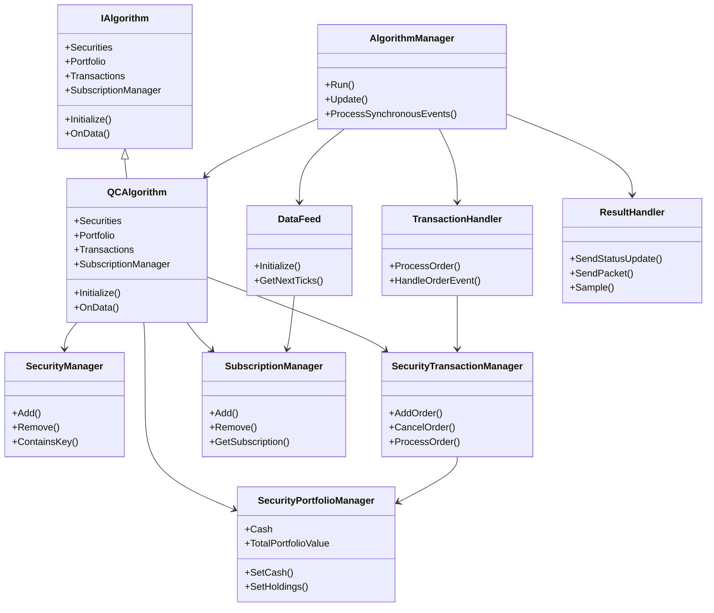
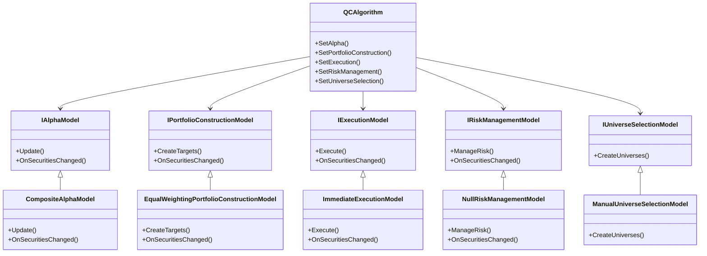
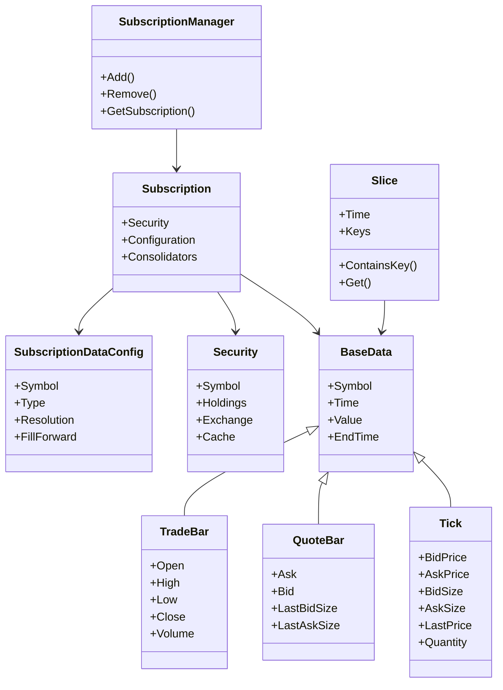
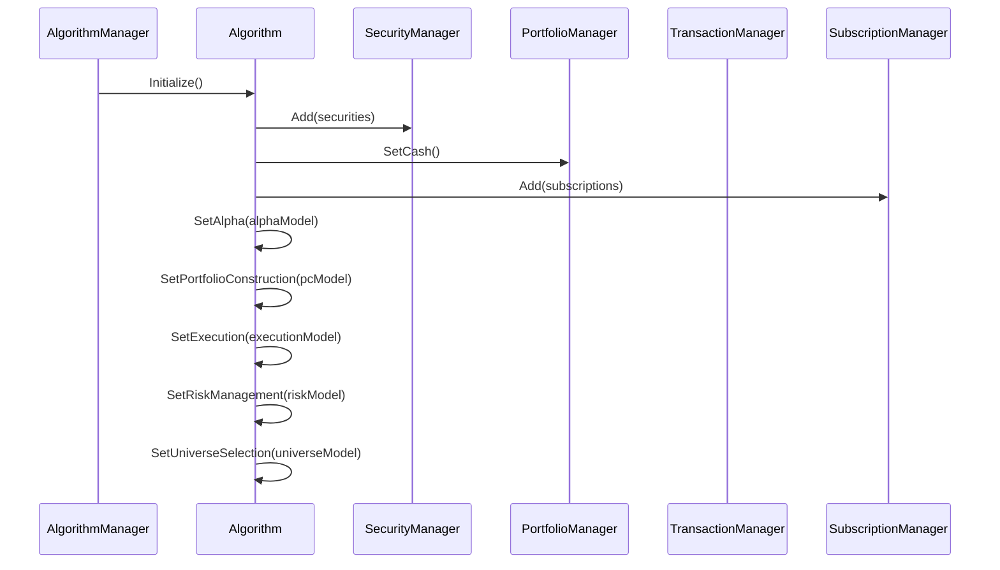
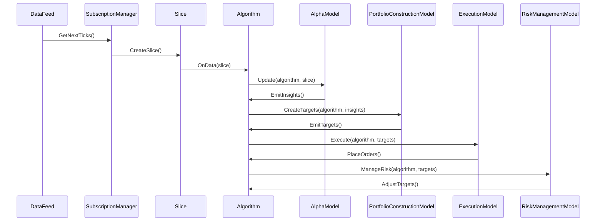
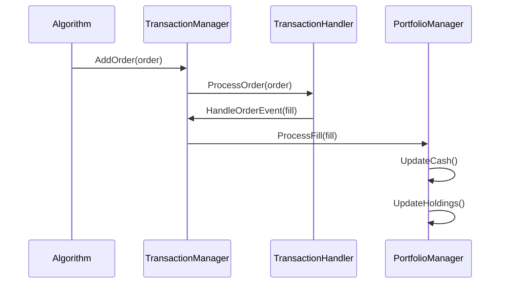
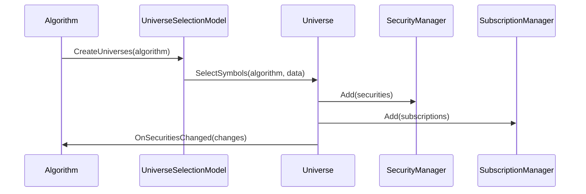

# Component Relationships

## Overview

QuantConnect Lean is composed of numerous components that interact with each other to form a complete algorithmic trading platform. This document details the relationships between these components, explaining how they communicate and depend on each other.

## Core Component Relationships

## Algorithm Framework Relationships

## Data System Relationships

## Component Interaction Patterns

### 1. Algorithm Initialization

During initialization, the algorithm sets up its components and subscriptions:

### 2. Data Processing

When new data arrives, it flows through the system:

### 3. Order Processing

When orders are placed, they flow through the transaction system:

### 4. Universe Selection

Universe selection determines which securities are included in the algorithm:

## Component Dependencies

### Algorithm Dependencies

The `QCAlgorithm` class depends on:

- `SecurityManager`: Manages the collection of securities
- `SecurityPortfolioManager`: Manages portfolio state
- `SecurityTransactionManager`: Manages order processing
- `SubscriptionManager`: Manages data subscriptions
- `UniverseManager`: Manages universe selection
- `RealTimeHandler`: Manages real-time events
- `NotificationManager`: Manages notifications

### Security Dependencies

The `Security` class depends on:

- `Exchange`: Manages exchange information
- `Cache`: Caches security data
- `Holdings`: Manages position information
- `SymbolProperties`: Contains symbol-specific properties
- `SecurityDataFilter`: Filters data for the security
- `SecurityPortfolioModel`: Models portfolio behavior for the security
- `SecurityMarginModel`: Models margin requirements for the security
- `SecurityFeeModel`: Models fees for the security
- `SecuritySlippageModel`: Models slippage for the security
- `SecurityFillModel`: Models fill behavior for the security
- `SecuritySettlementModel`: Models settlement behavior for the security

### Portfolio Dependencies

The `SecurityPortfolioManager` class depends on:

- `SecurityManager`: Provides access to securities
- `SecurityTransactionManager`: Provides access to transactions
- `CashBook`: Manages cash balances

### Transaction Dependencies

The `SecurityTransactionManager` class depends on:

- `SecurityManager`: Provides access to securities
- `OrderProcessor`: Processes orders

## Extensibility Points

Lean provides several extensibility points where custom components can be plugged in:

1. **Data Sources**: Custom data sources can be created by inheriting from `BaseData`
2. **Alpha Models**: Custom alpha models can be created by implementing `IAlphaModel`
3. **Portfolio Construction Models**: Custom portfolio construction models can be created by implementing `IPortfolioConstructionModel`
4. **Execution Models**: Custom execution models can be created by implementing `IExecutionModel`
5. **Risk Management Models**: Custom risk management models can be created by implementing `IRiskManagementModel`
6. **Universe Selection Models**: Custom universe selection models can be created by implementing `IUniverseSelectionModel`
7. **Brokerage Models**: Custom brokerage models can be created by implementing `IBrokerageModel`
8. **Fee Models**: Custom fee models can be created by implementing `IFeeModel`
9. **Slippage Models**: Custom slippage models can be created by implementing `ISlippageModel`
10. **Fill Models**: Custom fill models can be created by implementing `IFillModel`
11. **Settlement Models**: Custom settlement models can be created by implementing `ISettlementModel`
12. **Margin Models**: Custom margin models can be created by implementing `IMarginModel`

## Conclusion

The component relationships in Lean are designed to provide a flexible, extensible architecture that can be customized to meet the needs of different trading strategies. By understanding these relationships, developers can effectively leverage the platform's capabilities and extend it with custom components.