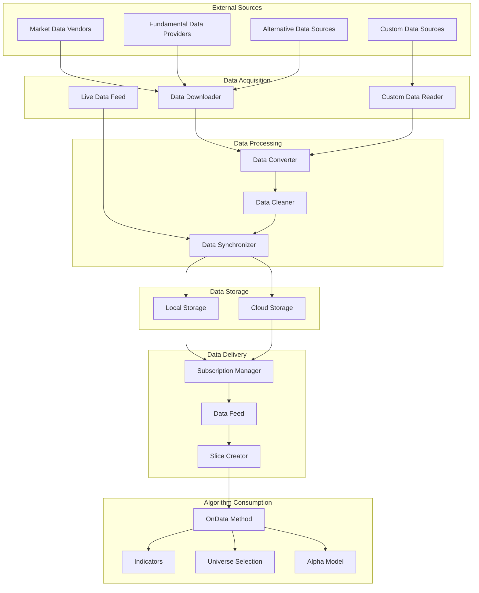
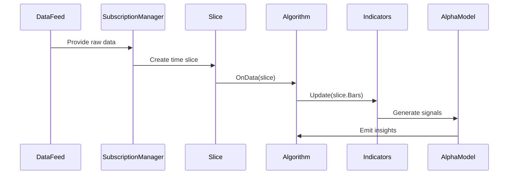

# Data Flow

## Overview

The data flow in QuantConnect Lean is a critical aspect of the system's architecture. This document details how data moves through the system, from acquisition to processing and finally to algorithm consumption.

## Data Flow Diagram

## Data Flow Stages

### 1. Data Acquisition

Data enters the system through various channels:

- **Historical Data**: Downloaded from data vendors and stored locally
- **Live Data**: Streamed in real-time from market data providers
- **Fundamental Data**: Company financials, earnings, etc.
- **Alternative Data**: News, social media sentiment, etc.
- **Custom Data**: User-defined data sources

Key components:
- `DataDownloader`: Downloads historical data
- `LiveTradingDataFeed`: Connects to live data sources
- `CustomDataReader`: Reads custom data formats

### 2. Data Processing

Raw data is processed into a standardized format:

- **Conversion**: Converting raw data into typed data objects
- **Cleaning**: Removing outliers and handling missing data
- **Synchronization**: Aligning data from different sources to the same time points

Key components:
- `BaseData`: Base class for all data types
- `SubscriptionDataReader`: Reads and processes subscription data
- `TimeSliceFactory`: Creates time-synchronized data slices

### 3. Data Storage

Processed data is stored for efficient retrieval:

- **Local Storage**: Data stored on the local file system
- **Cloud Storage**: Data stored in cloud storage (for cloud deployments)
- **In-Memory Cache**: Frequently accessed data cached in memory

Key components:
- `LocalObjectStore`: Stores objects locally
- `ObjectStore`: Interface for object storage
- `SingleEntryDataCacheProvider`: Caches data in memory

### 4. Data Delivery

Data is delivered to algorithms through a subscription mechanism:

- **Subscription**: Algorithms subscribe to specific data types for specific securities
- **Data Feed**: Delivers data to the algorithm
- **Slice**: A collection of data points at a specific time point

Key components:
- `SubscriptionManager`: Manages data subscriptions
- `IDataFeed`: Interface for data feeds
- `Slice`: Contains all data for a specific time point

### 5. Algorithm Consumption

Algorithms consume data through various mechanisms:

- **OnData Method**: Primary method for receiving data
- **Indicators**: Technical indicators process data
- **Universe Selection**: Data used for security selection
- **Alpha Models**: Data used for generating trading signals

Key components:
- `QCAlgorithm.OnData()`: Processes incoming data
- `IndicatorBase`: Base class for indicators
- `UniverseSelection`: Selects securities based on data
- `AlphaModel`: Generates insights based on data

## Data Types

Lean supports various data types:

1. **Market Data**
   - TradeBar: OHLCV data for a security
   - QuoteBar: Bid/ask data for a security
   - Tick: Individual trade or quote
   - OpenInterest: Open interest for futures and options

2. **Fundamental Data**
   - FineFundamental: Detailed company financials
   - CoarseFundamental: Basic company data
   - AssetClassification: Industry and sector classifications
   - CompanyProfile: Company information

3. **Alternative Data**
   - News: News articles and headlines
   - SEC Filings: Regulatory filings
   - Sentiment: Social media sentiment
   - Macroeconomic: Economic indicators

4. **Custom Data**
   - User-defined data types that inherit from BaseData

## Data Resolution

Data can be delivered at different resolutions:

- **Tick**: Individual trades or quotes
- **Second**: Data aggregated to 1-second bars
- **Minute**: Data aggregated to 1-minute bars
- **Hour**: Data aggregated to 1-hour bars
- **Daily**: Data aggregated to daily bars

## Data Consolidation

Data can be consolidated from higher resolutions to lower resolutions:

- **Time-Based Consolidation**: Aggregating data based on time periods
- **Tick-Based Consolidation**: Aggregating data based on number of ticks
- **Volume-Based Consolidation**: Aggregating data based on volume
- **Dollar-Based Consolidation**: Aggregating data based on dollar volume
- **Custom Consolidation**: User-defined consolidation logic

Key components:
- `IDataConsolidator`: Interface for data consolidators
- `TradeBarConsolidator`: Consolidates trade bars
- `QuoteBarConsolidator`: Consolidates quote bars
- `TickConsolidator`: Consolidates ticks

## Data Synchronization

Data from different sources is synchronized to ensure consistency:

- **Time Alignment**: Data points are aligned to the same time points
- **Fill Forward**: Missing data points are filled with the last known value
- **Time Zones**: Data from different time zones is converted to a common time zone

Key components:
- `TimeSlice`: Contains all data for a specific time point
- `FillForwardEnumerator`: Fills forward missing data points
- `TimeKeeper`: Manages time zones and conversions

## Example Data Flow

Here's an example of how data flows through the system for a simple moving average crossover strategy:

1. The DataFeed provides raw data to the SubscriptionManager
2. The SubscriptionManager creates a Slice containing all data for a specific time point
3. The Slice is passed to the Algorithm's OnData method
4. The Algorithm updates its Indicators with the new data
5. The Indicators are used by the AlphaModel to generate trading signals
6. The AlphaModel emits insights that drive trading decisions