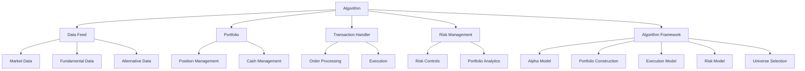
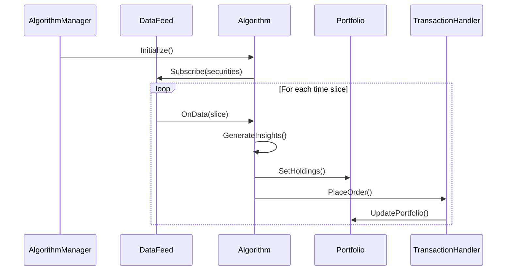

# System Design

## Overview

QuantConnect Lean employs a sophisticated system design that enables algorithmic trading across multiple asset classes. This document details the design patterns, architectural decisions, and system components that make up the Lean platform.

## Design Patterns

Lean utilizes several key design patterns:

### 1. Factory Pattern

The system uses factory patterns to create instances of various components:

- **AlgorithmFactory**: Creates algorithm instances based on language (C# or Python) and compilation output
- **SubscriptionDataFactory**: Creates data objects from raw data sources
- **SecurityFactory**: Creates security instances for different asset classes

### 2. Strategy Pattern

The strategy pattern is used extensively to allow interchangeable algorithms for various system behaviors:

- **Alpha Models**: Different strategies for generating trading signals
- **Portfolio Construction Models**: Different approaches to portfolio allocation
- **Execution Models**: Different methods for executing trades
- **Risk Management Models**: Different approaches to risk control

### 3. Observer Pattern

The observer pattern is used for event handling:

- **EventBasedDataQueueHandler**: Notifies subscribers of new data events
- **EventHandler**: Used throughout the system for event notifications

### 4. Adapter Pattern

Adapters are used to interface with external systems:

- **BrokerageAdapter**: Adapts between the internal order model and external brokerage APIs
- **DataAdapter**: Converts external data formats to the internal data model

### 5. Composite Pattern

The composite pattern is used in the Algorithm Framework:

- **CompositeAlphaModel**: Combines multiple alpha models
- **CompositePortfolioConstructionModel**: Combines multiple portfolio construction models
- **CompositeRiskManagementModel**: Combines multiple risk management models

## System Architecture

### High-Level Architecture

### Component Architecture

The system is composed of several key components:

1. **Engine**: Coordinates the execution of algorithms
   - AlgorithmManager: Manages algorithm lifecycle
   - DataFeeds: Provides data to algorithms
   - TransactionHandlers: Processes orders and executions
   - ResultHandlers: Processes and stores results

2. **Algorithm**: Contains the trading logic
   - QCAlgorithm: Base class for all algorithms
   - Framework Components: Alpha, Portfolio, Execution, Risk, Universe

3. **Data**: Manages market data
   - SubscriptionManager: Manages data subscriptions
   - DataFeeds: Provides data from various sources
   - Consolidators: Aggregates data into different time frames

4. **Securities**: Manages tradable assets
   - SecurityManager: Maintains the collection of securities
   - Security Models: Defines behavior for different asset classes
   - Market Hours: Manages trading hours and holidays

5. **Portfolio**: Manages portfolio state
   - SecurityPortfolioManager: Tracks positions and portfolio value
   - CashBook: Manages cash balances in different currencies

6. **Orders**: Manages order lifecycle
   - OrderProcessor: Processes orders
   - OrderTicket: Tracks order status and modifications

## Component Interactions

## Data Flow

The data flows through the system in the following manner:

1. **Data Acquisition**: Data is acquired from various sources (historical databases, live feeds)
2. **Data Processing**: Raw data is processed into a standardized format
3. **Data Delivery**: Processed data is delivered to the algorithm
4. **Signal Generation**: The algorithm processes the data to generate trading signals
5. **Portfolio Construction**: Signals are converted into target portfolio allocations
6. **Order Generation**: Target allocations are converted into orders
7. **Order Execution**: Orders are executed through a brokerage
8. **Portfolio Update**: The portfolio is updated based on executions
9. **Performance Reporting**: Performance metrics are calculated and reported

## Scalability and Performance

Lean is designed to handle large amounts of data and complex algorithms:

- **Parallel Processing**: Uses parallel processing for data handling and calculations
- **Memory Management**: Efficiently manages memory to handle large datasets
- **Resource Limits**: Enforces resource limits to prevent runaway algorithms
- **Caching**: Uses caching to improve performance for frequently accessed data

## Security and Reliability

The system includes several features for security and reliability:

- **Isolation**: Algorithms run in isolated environments
- **Error Handling**: Comprehensive error handling and logging
- **Monitoring**: Real-time monitoring of algorithm performance
- **Failover**: Mechanisms for handling component failures

## Extensibility

Lean is designed to be easily extended:

- **Plugin Architecture**: Components can be replaced or extended
- **Custom Data**: Support for custom data sources
- **Custom Securities**: Support for custom security types
- **Custom Models**: Support for custom models (alpha, portfolio, execution, risk)