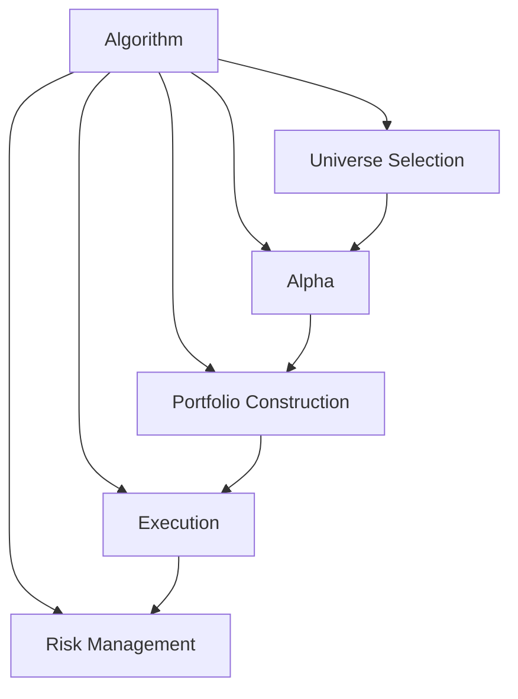

# Algorithm Framework

## Overview

The Algorithm Framework is a structured approach to building trading strategies in QuantConnect Lean. It separates the concerns of a trading algorithm into distinct components, each with a specific responsibility. This modular design makes algorithms more maintainable, testable, and reusable.

## Framework Components



### 1. Universe Selection

The Universe Selection component is responsible for selecting the securities that the algorithm will trade.

#### Interface

```csharp
public interface IUniverseSelectionModel
{
    IEnumerable<Universe> CreateUniverses(QCAlgorithm algorithm);
}
```

#### Key Methods

- `CreateUniverses`: Creates the universes for the algorithm based on the selection criteria.

#### Built-in Models

- `ManualUniverseSelectionModel`: Manually selects securities
- `FundamentalUniverseSelectionModel`: Selects securities based on fundamental data
- `ETFConstituentsUniverseSelectionModel`: Selects securities based on ETF constituents
- `OptionUniverseSelectionModel`: Selects option contracts
- `FutureUniverseSelectionModel`: Selects future contracts

#### Example

```csharp
public class MyUniverseSelectionModel : FundamentalUniverseSelectionModel
{
    public MyUniverseSelectionModel()
        : base(SelectCoarse, SelectFine)
    {
    }

    private static IEnumerable<Symbol> SelectCoarse(QCAlgorithm algorithm, IEnumerable<CoarseFundamental> coarse)
    {
        return coarse
            .OrderByDescending(x => x.DollarVolume)
            .Take(100)
            .Select(x => x.Symbol);
    }

    private static IEnumerable<Symbol> SelectFine(QCAlgorithm algorithm, IEnumerable<FineFundamental> fine)
    {
        return fine
            .OrderByDescending(x => x.MarketCap)
            .Take(10)
            .Select(x => x.Symbol);
    }
}
```

### 2. Alpha

The Alpha component is responsible for generating trading signals (insights) based on market data.

#### Interface

```csharp
public interface IAlphaModel
{
    IEnumerable<Insight> Update(QCAlgorithm algorithm, Slice data);
    void OnSecuritiesChanged(QCAlgorithm algorithm, SecurityChanges changes);
}
```

#### Key Methods

- `Update`: Generates insights based on the latest data
- `OnSecuritiesChanged`: Handles changes to the securities in the algorithm

#### Built-in Models

- `EmaCrossAlphaModel`: Generates insights based on EMA crossovers
- `MacdAlphaModel`: Generates insights based on MACD signals
- `RsiAlphaModel`: Generates insights based on RSI signals
- `ConstantAlphaModel`: Generates constant insights
- `HistoricalReturnsAlphaModel`: Generates insights based on historical returns
- `PearsonCorrelationPairsTradingAlphaModel`: Generates insights based on pairs trading

#### Example

```csharp
public class MyAlphaModel : AlphaModel
{
    private readonly Dictionary<Symbol, SymbolData> _symbolData;

    public MyAlphaModel()
    {
        _symbolData = new Dictionary<Symbol, SymbolData>();
        Name = nameof(MyAlphaModel);
    }

    public override IEnumerable<Insight> Update(QCAlgorithm algorithm, Slice data)
    {
        var insights = new List<Insight>();
        foreach (var kvp in _symbolData)
        {
            var symbol = kvp.Key;
            var symbolData = kvp.Value;
            
            if (symbolData.Indicator.IsReady)
            {
                var direction = symbolData.Indicator > 0 ? InsightDirection.Up : InsightDirection.Down;
                insights.Add(Insight.Price(symbol, TimeSpan.FromDays(1), direction));
            }
        }
        return insights;
    }

    public override void OnSecuritiesChanged(QCAlgorithm algorithm, SecurityChanges changes)
    {
        foreach (var security in changes.AddedSecurities)
        {
            _symbolData[security.Symbol] = new SymbolData(security.Symbol, algorithm);
        }
        foreach (var security in changes.RemovedSecurities)
        {
            _symbolData.Remove(security.Symbol);
        }
    }

    private class SymbolData
    {
        public Symbol Symbol { get; }
        public CustomIndicator Indicator { get; }

        public SymbolData(Symbol symbol, QCAlgorithm algorithm)
        {
            Symbol = symbol;
            Indicator = new CustomIndicator(symbol);
            algorithm.RegisterIndicator(symbol, Indicator, Resolution.Daily);
        }
    }
}
```

### 3. Portfolio Construction

The Portfolio Construction component is responsible for determining position sizes based on insights.

#### Interface

```csharp
public interface IPortfolioConstructionModel
{
    IEnumerable<IPortfolioTarget> CreateTargets(QCAlgorithm algorithm, Insight[] insights);
    void OnSecuritiesChanged(QCAlgorithm algorithm, SecurityChanges changes);
}
```

#### Key Methods

- `CreateTargets`: Creates portfolio targets based on insights
- `OnSecuritiesChanged`: Handles changes to the securities in the algorithm

#### Built-in Models

- `EqualWeightingPortfolioConstructionModel`: Assigns equal weights to all insights
- `InsightWeightingPortfolioConstructionModel`: Weights insights based on their properties
- `MeanVarianceOptimizationPortfolioConstructionModel`: Uses mean-variance optimization
- `BlackLittermanOptimizationPortfolioConstructionModel`: Uses Black-Litterman optimization
- `RiskParityPortfolioConstructionModel`: Uses risk parity allocation
- `SectorWeightingPortfolioConstructionModel`: Weights sectors equally

#### Example

```csharp
public class MyPortfolioConstructionModel : PortfolioConstructionModel
{
    private readonly Dictionary<Symbol, decimal> _symbolWeights;

    public MyPortfolioConstructionModel()
    {
        _symbolWeights = new Dictionary<Symbol, decimal>();
        Name = nameof(MyPortfolioConstructionModel);
    }

    public override IEnumerable<IPortfolioTarget> CreateTargets(QCAlgorithm algorithm, Insight[] insights)
    {
        var targets = new List<IPortfolioTarget>();
        
        // Group insights by symbol
        var symbolInsights = insights.GroupBy(x => x.Symbol);
        
        foreach (var symbolGroup in symbolInsights)
        {
            var symbol = symbolGroup.Key;
            var direction = symbolGroup.Select(x => x.Direction).DefaultIfEmpty(InsightDirection.Flat).First();
            
            decimal weight = 0;
            switch (direction)
            {
                case InsightDirection.Up:
                    weight = 0.1m; // 10% long
                    break;
                case InsightDirection.Down:
                    weight = -0.1m; // 10% short
                    break;
                case InsightDirection.Flat:
                    weight = 0m; // Flat
                    break;
            }
            
            _symbolWeights[symbol] = weight;
        }
        
        // Create targets for all symbols
        foreach (var kvp in _symbolWeights)
        {
            targets.Add(PortfolioTarget.Percent(algorithm, kvp.Key, kvp.Value));
        }
        
        return targets;
    }

    public override void OnSecuritiesChanged(QCAlgorithm algorithm, SecurityChanges changes)
    {
        foreach (var security in changes.AddedSecurities)
        {
            _symbolWeights[security.Symbol] = 0m;
        }
        foreach (var security in changes.RemovedSecurities)
        {
            _symbolWeights.Remove(security.Symbol);
        }
    }
}
```

### 4. Execution

The Execution component is responsible for converting portfolio targets into orders.

#### Interface

```csharp
public interface IExecutionModel
{
    void Execute(QCAlgorithm algorithm, IPortfolioTarget[] targets);
    void OnSecuritiesChanged(QCAlgorithm algorithm, SecurityChanges changes);
}
```

#### Key Methods

- `Execute`: Executes orders to achieve the portfolio targets
- `OnSecuritiesChanged`: Handles changes to the securities in the algorithm

#### Built-in Models

- `ImmediateExecutionModel`: Immediately executes orders to achieve targets
- `VolumeWeightedAveragePriceExecutionModel`: Uses VWAP for execution
- `StandardDeviationExecutionModel`: Uses standard deviation for execution
- `SpreadExecutionModel`: Uses spread for execution

#### Example

```csharp
public class MyExecutionModel : ExecutionModel
{
    private readonly Dictionary<Symbol, decimal> _symbolTargets;

    public MyExecutionModel()
    {
        _symbolTargets = new Dictionary<Symbol, decimal>();
        Name = nameof(MyExecutionModel);
    }

    public override void Execute(QCAlgorithm algorithm, IPortfolioTarget[] targets)
    {
        foreach (var target in targets)
        {
            var symbol = target.Symbol;
            var targetPercent = target.Quantity;
            
            // Store the target for this symbol
            _symbolTargets[symbol] = targetPercent;
            
            // Get the current holding for this symbol
            var holding = algorithm.Portfolio[symbol];
            
            // Calculate the order quantity
            var portfolioValue = algorithm.Portfolio.TotalPortfolioValue;
            var targetValue = portfolioValue * targetPercent;
            var currentValue = holding.HoldingsValue;
            var deltaValue = targetValue - currentValue;
            
            if (Math.Abs(deltaValue) < 10)
            {
                // Skip small orders
                continue;
            }
            
            var price = algorithm.Securities[symbol].Price;
            var shares = (int)(deltaValue / price);
            
            if (shares > 0)
            {
                algorithm.MarketOrder(symbol, shares);
            }
            else if (shares < 0)
            {
                algorithm.MarketOrder(symbol, shares);
            }
        }
    }

    public override void OnSecuritiesChanged(QCAlgorithm algorithm, SecurityChanges changes)
    {
        foreach (var security in changes.AddedSecurities)
        {
            _symbolTargets[security.Symbol] = 0m;
        }
        foreach (var security in changes.RemovedSecurities)
        {
            _symbolTargets.Remove(security.Symbol);
        }
    }
}
```

### 5. Risk Management

The Risk Management component is responsible for applying risk controls to orders.

#### Interface

```csharp
public interface IRiskManagementModel
{
    IEnumerable<IPortfolioTarget> ManageRisk(QCAlgorithm algorithm, IPortfolioTarget[] targets);
    void OnSecuritiesChanged(QCAlgorithm algorithm, SecurityChanges changes);
}
```

#### Key Methods

- `ManageRisk`: Applies risk controls to portfolio targets
- `OnSecuritiesChanged`: Handles changes to the securities in the algorithm

#### Built-in Models

- `NullRiskManagementModel`: Does not apply any risk controls
- `MaximumDrawdownPercentPerSecurity`: Limits drawdown per security
- `MaximumDrawdownPercentPortfolio`: Limits drawdown for the entire portfolio
- `MaximumSectorExposureRiskManagementModel`: Limits exposure to sectors
- `MaximumUnrealizedProfitPercentPerSecurity`: Limits unrealized profit per security
- `TrailingStopRiskManagementModel`: Applies trailing stops

#### Example

```csharp
public class MyRiskManagementModel : RiskManagementModel
{
    private readonly Dictionary<Symbol, decimal> _symbolMaxExposure;

    public MyRiskManagementModel()
    {
        _symbolMaxExposure = new Dictionary<Symbol, decimal>();
        Name = nameof(MyRiskManagementModel);
    }

    public override IEnumerable<IPortfolioTarget> ManageRisk(QCAlgorithm algorithm, IPortfolioTarget[] targets)
    {
        var riskAdjustedTargets = new List<IPortfolioTarget>();
        
        foreach (var target in targets)
        {
            var symbol = target.Symbol;
            var targetPercent = target.Quantity;
            
            // Get the maximum allowed exposure for this symbol
            var maxExposure = _symbolMaxExposure.GetValueOrDefault(symbol, 0.1m); // Default to 10%
            
            // Limit the target to the maximum exposure
            var limitedTarget = Math.Min(Math.Abs(targetPercent), maxExposure) * Math.Sign(targetPercent);
            
            riskAdjustedTargets.Add(PortfolioTarget.Percent(algorithm, symbol, limitedTarget));
        }
        
        return riskAdjustedTargets;
    }

    public override void OnSecuritiesChanged(QCAlgorithm algorithm, SecurityChanges changes)
    {
        foreach (var security in changes.AddedSecurities)
        {
            _symbolMaxExposure[security.Symbol] = 0.1m; // Default to 10%
        }
        foreach (var security in changes.RemovedSecurities)
        {
            _symbolMaxExposure.Remove(security.Symbol);
        }
    }
}
```

## Putting It All Together

To use the Algorithm Framework, you need to set up each component in your algorithm:

```csharp
public class MyAlgorithm : QCAlgorithm
{
    public override void Initialize()
    {
        SetStartDate(2018, 1, 1);
        SetEndDate(2018, 12, 31);
        SetCash(100000);
        
        // Set up the universe selection model
        SetUniverseSelection(new MyUniverseSelectionModel());
        
        // Set up the alpha model
        SetAlpha(new MyAlphaModel());
        
        // Set up the portfolio construction model
        SetPortfolioConstruction(new MyPortfolioConstructionModel());
        
        // Set up the execution model
        SetExecution(new MyExecutionModel());
        
        // Set up the risk management model
        SetRiskManagement(new MyRiskManagementModel());
    }
}
```

## Composite Models

Lean also supports composite models that combine multiple models of the same type:

```csharp
public class MyAlgorithm : QCAlgorithm
{
    public override void Initialize()
    {
        SetStartDate(2018, 1, 1);
        SetEndDate(2018, 12, 31);
        SetCash(100000);
        
        // Set up a composite alpha model
        SetAlpha(new CompositeAlphaModel(
            new EmaCrossAlphaModel(),
            new MacdAlphaModel(),
            new RsiAlphaModel()
        ));
        
        // Set up the rest of the framework
        SetPortfolioConstruction(new EqualWeightingPortfolioConstructionModel());
        SetExecution(new ImmediateExecutionModel());
        SetRiskManagement(new NullRiskManagementModel());
    }
}
```

## Conclusion

The Algorithm Framework provides a structured approach to building trading strategies in Lean. By separating concerns into distinct components, it makes algorithms more maintainable, testable, and reusable. Each component can be developed and tested independently, and then combined to form a complete trading strategy.