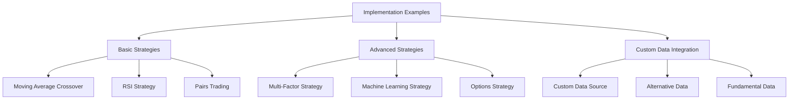

# Implementation Examples

## Overview

This section provides practical examples of implementing trading strategies using QuantConnect Lean. These examples demonstrate how to use the various components of Lean to build, test, and deploy algorithmic trading strategies.

## Example Categories



### 1. Basic Strategies

Basic strategies demonstrate fundamental concepts in algorithmic trading. They are simple to understand and implement, making them ideal for beginners.

[Learn more about Basic Strategies](./basic-strategies.md)

### 2. Advanced Strategies

Advanced strategies demonstrate more complex trading concepts and techniques. They often combine multiple components and may require more sophisticated analysis.

[Learn more about Advanced Strategies](./advanced-strategies.md)

### 3. Custom Data Integration

Custom data integration examples demonstrate how to incorporate external data sources into your trading strategies. This can include alternative data, fundamental data, or any other data source not provided by default in Lean.

[Learn more about Custom Data Integration](./custom-data.md)

## Basic Strategy Examples

### 1. Moving Average Crossover

The Moving Average Crossover strategy is one of the simplest and most widely used trading strategies. It generates buy signals when a short-term moving average crosses above a long-term moving average, and sell signals when the short-term moving average crosses below the long-term moving average.

```csharp
public class MovingAverageCrossoverAlgorithm : QCAlgorithm
{
    private SimpleMovingAverage _fast;
    private SimpleMovingAverage _slow;
    
    public override void Initialize()
    {
        SetStartDate(2018, 1, 1);
        SetEndDate(2018, 12, 31);
        SetCash(100000);
        
        AddEquity("SPY");
        
        _fast = SMA("SPY", 50);
        _slow = SMA("SPY", 200);
    }
    
    public override void OnData(Slice data)
    {
        if (!_fast.IsReady || !_slow.IsReady)
            return;
        
        if (!Portfolio.Invested && _fast > _slow)
        {
            SetHoldings("SPY", 1.0);
        }
        else if (Portfolio.Invested && _fast < _slow)
        {
            Liquidate();
        }
    }
}
```

### 2. RSI Strategy

The Relative Strength Index (RSI) strategy is a momentum oscillator that measures the speed and change of price movements. It generates buy signals when the RSI falls below an oversold threshold and then rises back above it, and sell signals when the RSI rises above an overbought threshold and then falls back below it.

```csharp
public class RsiAlgorithm : QCAlgorithm
{
    private RelativeStrengthIndex _rsi;
    private decimal _overbought = 70m;
    private decimal _oversold = 30m;
    
    public override void Initialize()
    {
        SetStartDate(2018, 1, 1);
        SetEndDate(2018, 12, 31);
        SetCash(100000);
        
        AddEquity("SPY");
        
        _rsi = RSI("SPY", 14);
    }
    
    public override void OnData(Slice data)
    {
        if (!_rsi.IsReady)
            return;
        
        if (!Portfolio.Invested && _rsi < _oversold)
        {
            SetHoldings("SPY", 1.0);
        }
        else if (Portfolio.Invested && _rsi > _overbought)
        {
            Liquidate();
        }
    }
}
```

### 3. Pairs Trading

Pairs trading is a market-neutral strategy that matches a long position in one security with a short position in another security. The strategy is based on the assumption that the two securities have a stable relationship, and when the relationship deviates from its historical norm, it will eventually revert back.

```csharp
public class PairsTradingAlgorithm : QCAlgorithm
{
    private Symbol _symbol1;
    private Symbol _symbol2;
    private decimal _spread;
    private decimal _meanSpread;
    private decimal _stdDevSpread;
    private int _lookbackPeriod = 20;
    private List<decimal> _spreadHistory = new List<decimal>();
    
    public override void Initialize()
    {
        SetStartDate(2018, 1, 1);
        SetEndDate(2018, 12, 31);
        SetCash(100000);
        
        _symbol1 = AddEquity("AAPL").Symbol;
        _symbol2 = AddEquity("MSFT").Symbol;
    }
    
    public override void OnData(Slice data)
    {
        if (!data.ContainsKey(_symbol1) || !data.ContainsKey(_symbol2))
            return;
        
        var price1 = data[_symbol1].Close;
        var price2 = data[_symbol2].Close;
        
        _spread = price1 / price2;
        _spreadHistory.Add(_spread);
        
        if (_spreadHistory.Count > _lookbackPeriod)
            _spreadHistory.RemoveAt(0);
        
        if (_spreadHistory.Count < _lookbackPeriod)
            return;
        
        _meanSpread = _spreadHistory.Average();
        _stdDevSpread = StandardDeviation(_spreadHistory);
        
        var zscore = (_spread - _meanSpread) / _stdDevSpread;
        
        if (zscore > 2 && !Portfolio.Invested)
        {
            // Spread is too high, short symbol1 and long symbol2
            SetHoldings(_symbol1, -0.5);
            SetHoldings(_symbol2, 0.5);
        }
        else if (zscore < -2 && !Portfolio.Invested)
        {
            // Spread is too low, long symbol1 and short symbol2
            SetHoldings(_symbol1, 0.5);
            SetHoldings(_symbol2, -0.5);
        }
        else if (Math.Abs(zscore) < 0.5 && Portfolio.Invested)
        {
            // Spread has reverted to mean, liquidate positions
            Liquidate();
        }
    }
    
    private decimal StandardDeviation(List<decimal> values)
    {
        var mean = values.Average();
        var sumOfSquares = values.Sum(x => (x - mean) * (x - mean));
        return (decimal)Math.Sqrt((double)(sumOfSquares / values.Count));
    }
}
```

## Advanced Strategy Examples

### 1. Multi-Factor Strategy

Multi-factor strategies combine multiple factors or signals to make trading decisions. They often use a scoring system to rank securities based on various factors and then select the top-ranked securities for investment.

```csharp
public class MultifactorAlgorithm : QCAlgorithm
{
    private List<Symbol> _symbols = new List<Symbol>();
    private Dictionary<Symbol, decimal> _momentumScores = new Dictionary<Symbol, decimal>();
    private Dictionary<Symbol, decimal> _valueScores = new Dictionary<Symbol, decimal>();
    private Dictionary<Symbol, decimal> _qualityScores = new Dictionary<Symbol, decimal>();
    
    public override void Initialize()
    {
        SetStartDate(2018, 1, 1);
        SetEndDate(2018, 12, 31);
        SetCash(100000);
        
        // Add universe selection
        AddUniverse(CoarseSelectionFunction, FineSelectionFunction);
        
        // Schedule rebalancing
        Schedule.On(DateRules.MonthStart(), TimeRules.AfterMarketOpen("SPY"), Rebalance);
    }
    
    public IEnumerable<Symbol> CoarseSelectionFunction(IEnumerable<CoarseFundamental> coarse)
    {
        return coarse
            .Where(x => x.Price > 10 && x.DollarVolume > 10000000)
            .OrderByDescending(x => x.DollarVolume)
            .Take(100)
            .Select(x => x.Symbol);
    }
    
    public IEnumerable<Symbol> FineSelectionFunction(IEnumerable<FineFundamental> fine)
    {
        _symbols = fine
            .Where(x => x.ValuationRatios.PERatio > 0)
            .Take(50)
            .Select(x => x.Symbol)
            .ToList();
        
        return _symbols;
    }
    
    public void Rebalance()
    {
        if (_symbols.Count == 0)
            return;
        
        // Calculate factor scores
        CalculateMomentumScores();
        CalculateValueScores();
        CalculateQualityScores();
        
        // Combine factor scores
        var combinedScores = new Dictionary<Symbol, decimal>();
        foreach (var symbol in _symbols)
        {
            var momentumScore = _momentumScores.GetValueOrDefault(symbol, 0);
            var valueScore = _valueScores.GetValueOrDefault(symbol, 0);
            var qualityScore = _qualityScores.GetValueOrDefault(symbol, 0);
            
            combinedScores[symbol] = momentumScore + valueScore + qualityScore;
        }
        
        // Select top 10 securities
        var topSymbols = combinedScores
            .OrderByDescending(x => x.Value)
            .Take(10)
            .Select(x => x.Key)
            .ToList();
        
        // Liquidate existing positions that are not in the top 10
        foreach (var holding in Portfolio.Values)
        {
            if (holding.Invested && !topSymbols.Contains(holding.Symbol))
            {
                Liquidate(holding.Symbol);
            }
        }
        
        // Invest in top 10 securities with equal weight
        foreach (var symbol in topSymbols)
        {
            SetHoldings(symbol, 0.1);
        }
    }
    
    private void CalculateMomentumScores()
    {
        _momentumScores.Clear();
        
        foreach (var symbol in _symbols)
        {
            var history = History(symbol, 252, Resolution.Daily);
            if (history.Count() == 0)
                continue;
            
            var prices = history.Select(x => x.Close).ToList();
            var returns = new List<decimal>();
            
            for (int i = 1; i < prices.Count; i++)
            {
                returns.Add(prices[i] / prices[i - 1] - 1);
            }
            
            var momentum = returns.TakeLast(63).Sum(); // 3-month momentum
            _momentumScores[symbol] = momentum;
        }
        
        // Normalize scores
        NormalizeScores(_momentumScores);
    }
    
    private void CalculateValueScores()
    {
        _valueScores.Clear();
        
        foreach (var symbol in _symbols)
        {
            var security = Securities[symbol];
            var fundamental = security.Fundamentals;
            
            if (fundamental == null)
                continue;
            
            var pe = fundamental.ValuationRatios.PERatio;
            var pb = fundamental.ValuationRatios.PBRatio;
            
            if (pe <= 0 || pb <= 0)
                continue;
            
            var valueScore = 1 / pe + 1 / pb; // Lower PE and PB ratios are better for value
            _valueScores[symbol] = valueScore;
        }
        
        // Normalize scores
        NormalizeScores(_valueScores);
    }
    
    private void CalculateQualityScores()
    {
        _qualityScores.Clear();
        
        foreach (var symbol in _symbols)
        {
            var security = Securities[symbol];
            var fundamental = security.Fundamentals;
            
            if (fundamental == null)
                continue;
            
            var roe = fundamental.OperationRatios.ROE;
            var roa = fundamental.OperationRatios.ROA;
            
            if (roe <= 0 || roa <= 0)
                continue;
            
            var qualityScore = roe + roa; // Higher ROE and ROA are better for quality
            _qualityScores[symbol] = qualityScore;
        }
        
        // Normalize scores
        NormalizeScores(_qualityScores);
    }
    
    private void NormalizeScores(Dictionary<Symbol, decimal> scores)
    {
        if (scores.Count == 0)
            return;
        
        var min = scores.Values.Min();
        var max = scores.Values.Max();
        
        if (max == min)
            return;
        
        foreach (var symbol in scores.Keys.ToList())
        {
            scores[symbol] = (scores[symbol] - min) / (max - min);
        }
    }
}
```

### 2. Machine Learning Strategy

Machine learning strategies use statistical models to make predictions about future price movements. They often involve training a model on historical data and then using the model to make predictions on new data.

```python
class MachineLearningAlgorithm(QCAlgorithm):
    
    def Initialize(self):
        self.SetStartDate(2018, 1, 1)
        self.SetEndDate(2018, 12, 31)
        self.SetCash(100000)
        
        self.symbol = self.AddEquity("SPY").Symbol
        
        self.lookback = 20
        self.features = 5
        self.split = 0.8
        
        self.SetWarmUp(self.lookback)
        
        # Schedule training and prediction
        self.Schedule.On(self.DateRules.EveryDay(self.symbol), self.TimeRules.AfterMarketOpen(self.symbol), self.TrainModel)
        self.Schedule.On(self.DateRules.EveryDay(self.symbol), self.TimeRules.AfterMarketOpen(self.symbol, 10), self.MakePrediction)
        
        self.model = None
        self.prediction = None
    
    def TrainModel(self):
        if self.IsWarmingUp:
            return
        
        # Get historical data
        history = self.History(self.symbol, self.lookback, Resolution.Daily)
        if len(history) < self.lookback:
            return
        
        # Prepare features and labels
        X = []
        y = []
        
        for i in range(len(history) - self.features):
            features = []
            for j in range(self.features):
                features.append(float(history.iloc[i + j].close))
            
            X.append(features)
            y.append(1 if history.iloc[i + self.features].close > history.iloc[i + self.features - 1].close else 0)
        
        # Split data into training and testing sets
        split_idx = int(len(X) * self.split)
        X_train = X[:split_idx]
        y_train = y[:split_idx]
        
        # Train the model
        from sklearn.ensemble import RandomForestClassifier
        self.model = RandomForestClassifier(n_estimators=100)
        self.model.fit(X_train, y_train)
    
    def MakePrediction(self):
        if self.IsWarmingUp or self.model is None:
            return
        
        # Get recent data for prediction
        history = self.History(self.symbol, self.features, Resolution.Daily)
        if len(history) < self.features:
            return
        
        # Prepare features for prediction
        features = []
        for i in range(self.features):
            features.append(float(history.iloc[i].close))
        
        # Make prediction
        self.prediction = self.model.predict([features])[0]
        
        # Execute trades based on prediction
        if self.prediction == 1 and not self.Portfolio.Invested:
            self.SetHoldings(self.symbol, 1.0)
        elif self.prediction == 0 and self.Portfolio.Invested:
            self.Liquidate()
```

### 3. Options Strategy

Options strategies involve trading options contracts rather than the underlying securities. They can be used to generate income, hedge risk, or speculate on price movements.

```csharp
public class CoveredCallAlgorithm : QCAlgorithm
{
    private Symbol _equity;
    private Symbol _option;
    private int _strikePrice;
    
    public override void Initialize()
    {
        SetStartDate(2018, 1, 1);
        SetEndDate(2018, 12, 31);
        SetCash(100000);
        
        // Add equity
        _equity = AddEquity("SPY").Symbol;
        
        // Add option
        var option = AddOption("SPY");
        option.SetFilter(universe => universe
            .Strikes(-10, +10)
            .Expiration(0, 30)
            .IncludeWeeklys());
        
        // Schedule rebalancing
        Schedule.On(DateRules.MonthStart(), TimeRules.AfterMarketOpen("SPY"), Rebalance);
    }
    
    public override void OnData(Slice slice)
    {
        if (!Portfolio.Invested)
            return;
        
        if (slice.OptionChains.Count == 0)
            return;
        
        var chain = slice.OptionChains[_equity];
        if (chain.Count == 0)
            return;
        
        // Check if our option has expired
        var option = chain.Where(x => x.Symbol == _option).FirstOrDefault();
        if (option == null || option.Expiry.Date <= Time.Date)
        {
            _option = null;
            Rebalance();
        }
    }
    
    public void Rebalance()
    {
        // Buy the equity if we don't already own it
        if (!Portfolio[_equity].Invested)
        {
            SetHoldings(_equity, 0.8);
        }
        
        // Wait for equity order to fill
        if (!Portfolio[_equity].Invested)
            return;
        
        // Get the option chain
        var chains = OptionChains.GetAllOptionChains();
        if (chains.Count == 0)
            return;
        
        var chain = chains[_equity];
        if (chain.Count == 0)
            return;
        
        // Find the nearest call option above the current price
        var calls = chain
            .Where(x => x.Right == OptionRight.Call)
            .Where(x => x.Expiry > Time.Date.AddDays(20) && x.Expiry <= Time.Date.AddDays(30))
            .OrderBy(x => x.Expiry)
            .ThenBy(x => Math.Abs(x.Strike - Securities[_equity].Price))
            .ToList();
        
        if (calls.Count == 0)
            return;
        
        var call = calls.First();
        _option = call.Symbol;
        _strikePrice = (int)call.Strike;
        
        // Sell the call option
        Sell(_option, 1);
    }
}
```

## Custom Data Integration Examples

### 1. Custom Data Source

Custom data sources allow you to incorporate external data into your trading strategies. This example demonstrates how to create a custom data source for weather data.

```csharp
public class WeatherData : BaseData
{
    public decimal Temperature { get; set; }
    public decimal Precipitation { get; set; }
    public decimal WindSpeed { get; set; }
    
    public override DateTime EndTime => Time + TimeSpan.FromDays(1);
    
    public override SubscriptionDataSource GetSource(SubscriptionDataConfig config, DateTime date, bool isLiveMode)
    {
        var source = Path.Combine(
            Globals.DataFolder,
            "weather",
            config.Symbol.Value.ToLower(),
            $"{date:yyyyMMdd}.csv"
        );
        
        return new SubscriptionDataSource(source, SubscriptionTransportMedium.LocalFile);
    }
    
    public override BaseData Reader(SubscriptionDataConfig config, string line, DateTime date, bool isLiveMode)
    {
        var csv = line.Split(',');
        
        return new WeatherData
        {
            Symbol = config.Symbol,
            Time = date,
            Temperature = decimal.Parse(csv[1]),
            Precipitation = decimal.Parse(csv[2]),
            WindSpeed = decimal.Parse(csv[3]),
            Value = decimal.Parse(csv[1]) // Temperature as the value
        };
    }
}

public class WeatherAlgorithm : QCAlgorithm
{
    private Symbol _weather;
    private Symbol _equity;
    
    public override void Initialize()
    {
        SetStartDate(2018, 1, 1);
        SetEndDate(2018, 12, 31);
        SetCash(100000);
        
        // Add custom data
        _weather = AddData<WeatherData>("NYC").Symbol;
        
        // Add equity
        _equity = AddEquity("KO").Symbol;
    }
    
    public override void OnData(Slice data)
    {
        if (!data.ContainsKey(_weather))
            return;
        
        var weather = data[_weather];
        
        // Trading logic based on weather data
        if (weather.Temperature > 30 && !Portfolio[_equity].Invested)
        {
            // Hot day, buy Coca-Cola
            SetHoldings(_equity, 1.0);
        }
        else if (weather.Temperature < 10 && Portfolio[_equity].Invested)
        {
            // Cold day, sell Coca-Cola
            Liquidate(_equity);
        }
    }
}
```

### 2. Alternative Data

Alternative data refers to non-traditional data sources that can provide unique insights for trading strategies. This example demonstrates how to use sentiment data from social media.

```csharp
public class SentimentData : BaseData
{
    public decimal Sentiment { get; set; }
    public int Volume { get; set; }
    
    public override DateTime EndTime => Time + TimeSpan.FromDays(1);
    
    public override SubscriptionDataSource GetSource(SubscriptionDataConfig config, DateTime date, bool isLiveMode)
    {
        var source = Path.Combine(
            Globals.DataFolder,
            "sentiment",
            config.Symbol.Value.ToLower(),
            $"{date:yyyyMMdd}.csv"
        );
        
        return new SubscriptionDataSource(source, SubscriptionTransportMedium.LocalFile);
    }
    
    public override BaseData Reader(SubscriptionDataConfig config, string line, DateTime date, bool isLiveMode)
    {
        var csv = line.Split(',');
        
        return new SentimentData
        {
            Symbol = config.Symbol,
            Time = date,
            Sentiment = decimal.Parse(csv[1]),
            Volume = int.Parse(csv[2]),
            Value = decimal.Parse(csv[1]) // Sentiment as the value
        };
    }
}

public class SentimentAlgorithm : QCAlgorithm
{
    private Dictionary<Symbol, Symbol> _sentimentMap = new Dictionary<Symbol, Symbol>();
    
    public override void Initialize()
    {
        SetStartDate(2018, 1, 1);
        SetEndDate(2018, 12, 31);
        SetCash(100000);
        
        // Add equities
        var symbols = new[] { "AAPL", "MSFT", "GOOG" };
        foreach (var ticker in symbols)
        {
            var equity = AddEquity(ticker).Symbol;
            var sentiment = AddData<SentimentData>(ticker).Symbol;
            _sentimentMap[sentiment] = equity;
        }
    }
    
    public override void OnData(Slice data)
    {
        var sentiments = new Dictionary<Symbol, decimal>();
        
        // Collect sentiment data
        foreach (var kvp in data.Where(x => x.Value is SentimentData))
        {
            var sentiment = (SentimentData)kvp.Value;
            var equitySymbol = _sentimentMap[sentiment.Symbol];
            sentiments[equitySymbol] = sentiment.Sentiment;
        }
        
        if (sentiments.Count == 0)
            return;
        
        // Rank securities by sentiment
        var rankedSecurities = sentiments
            .OrderByDescending(x => x.Value)
            .ToList();
        
        // Liquidate positions in securities with negative sentiment
        foreach (var kvp in rankedSecurities.Where(x => x.Value < 0))
        {
            if (Portfolio[kvp.Key].Invested)
            {
                Liquidate(kvp.Key);
            }
        }
        
        // Invest in securities with positive sentiment
        foreach (var kvp in rankedSecurities.Where(x => x.Value > 0))
        {
            if (!Portfolio[kvp.Key].Invested)
            {
                SetHoldings(kvp.Key, 1.0 / rankedSecurities.Count(x => x.Value > 0));
            }
        }
    }
}
```

### 3. Fundamental Data

Fundamental data refers to financial data about companies, such as financial statements, ratios, and other metrics. This example demonstrates how to use fundamental data in a trading strategy.

```csharp
public class FundamentalAlgorithm : QCAlgorithm
{
    public override void Initialize()
    {
        SetStartDate(2018, 1, 1);
        SetEndDate(2018, 12, 31);
        SetCash(100000);
        
        // Add universe selection
        AddUniverse(CoarseSelectionFunction, FineSelectionFunction);
        
        // Schedule rebalancing
        Schedule.On(DateRules.MonthStart(), TimeRules.AfterMarketOpen("SPY"), Rebalance);
    }
    
    public IEnumerable<Symbol> CoarseSelectionFunction(IEnumerable<CoarseFundamental> coarse)
    {
        return coarse
            .Where(x => x.Price > 10 && x.DollarVolume > 10000000)
            .OrderByDescending(x => x.DollarVolume)
            .Take(100)
            .Select(x => x.Symbol);
    }
    
    public IEnumerable<Symbol> FineSelectionFunction(IEnumerable<FineFundamental> fine)
    {
        return fine
            .Where(x => x.ValuationRatios.PERatio > 0 && x.ValuationRatios.PERatio < 20)
            .Where(x => x.ValuationRatios.PBRatio > 0 && x.ValuationRatios.PBRatio < 5)
            .Where(x => x.OperationRatios.ROE > 0.1m)
            .OrderBy(x => x.ValuationRatios.PERatio)
            .Take(10)
            .Select(x => x.Symbol);
    }
    
    public void Rebalance()
    {
        // Liquidate existing positions that are not in the universe
        foreach (var holding in Portfolio.Values)
        {
            if (holding.Invested && !UniverseManager.ActiveSecurities.ContainsKey(holding.Symbol))
            {
                Liquidate(holding.Symbol);
            }
        }
        
        // Invest in securities in the universe with equal weight
        var count = UniverseManager.ActiveSecurities.Count;
        if (count == 0)
            return;
        
        foreach (var kvp in UniverseManager.ActiveSecurities)
        {
            SetHoldings(kvp.Key, 1.0 / count);
        }
    }
}
```

## Best Practices

### 1. Start Simple

Start with simple strategies and gradually add complexity as you gain experience. Simple strategies are easier to understand, implement, and debug.

### 2. Test Thoroughly

Test your strategies thoroughly using historical data before deploying them in a live environment. Use different time periods and market conditions to ensure robustness.

### 3. Consider Transaction Costs

Include transaction costs in your backtests to get a more realistic estimate of strategy performance. High-frequency strategies may not be profitable when transaction costs are considered.

### 4. Manage Risk

Implement proper risk management to protect your portfolio from significant drawdowns. This can include position sizing, stop-loss orders, and diversification.

### 5. Monitor Performance

Regularly monitor the performance of your strategies and make adjustments as needed. Market conditions change over time, and strategies that worked in the past may not work in the future.

## Next Steps

For detailed information about each example category, refer to the individual category documentation:

- [Basic Strategies](./basic-strategies.md)
- [Advanced Strategies](./advanced-strategies.md)
- [Custom Data Integration](./custom-data.md)