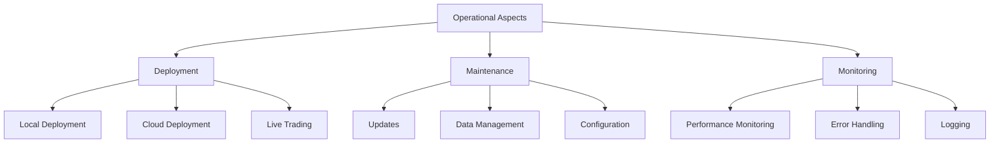

# Operational Aspects

## Overview

This section provides detailed documentation on the operational aspects of QuantConnect Lean. It covers deployment, maintenance, monitoring, and other operational considerations for running algorithmic trading strategies in production.

## Operational Components



### 1. Deployment

Deployment covers the process of setting up and running Lean in different environments, including local development, cloud-based backtesting, and live trading.

[Learn more about Deployment](./deployment.md)

### 2. Maintenance

Maintenance covers the ongoing tasks required to keep Lean running smoothly, including updates, data management, and configuration.

[Learn more about Maintenance](./maintenance.md)

### 3. Monitoring

Monitoring covers the tools and techniques for tracking the performance and health of Lean and the trading strategies it runs.

[Learn more about Monitoring](./monitoring.md)

## Deployment Options

Lean can be deployed in several different environments:

### 1. Local Development

Local development involves running Lean on your local machine for development and testing purposes.

#### Requirements

- Windows, macOS, or Linux operating system
- .NET Core SDK
- Python (optional, for Python algorithms)
- IDE (Visual Studio, VS Code, etc.)

#### Setup

1. Clone the Lean repository:
   ```bash
   git clone https://github.com/QuantConnect/Lean.git
   ```

2. Build the solution:
   ```bash
   cd Lean
   dotnet build
   ```

3. Configure Lean:
   - Edit `config.json` to set up data sources, algorithm selection, etc.

4. Run Lean:
   ```bash
   cd Launcher/bin/Debug
   dotnet QuantConnect.Lean.Launcher.dll
   ```

### 2. Docker

Docker provides a containerized environment for running Lean, ensuring consistency across different machines and environments.

#### Requirements

- Docker installed on your machine

#### Setup

1. Clone the Lean repository:
   ```bash
   git clone https://github.com/QuantConnect/Lean.git
   ```

2. Build the Docker image:
   ```bash
   cd Lean
   docker build -t lean .
   ```

3. Run Lean in a Docker container:
   ```bash
   docker run -it --name lean lean
   ```

### 3. Cloud Deployment

Cloud deployment involves running Lean on cloud infrastructure, such as AWS, Azure, or Google Cloud.

#### Requirements

- Cloud provider account (AWS, Azure, Google Cloud, etc.)
- Knowledge of cloud infrastructure and deployment

#### Setup

1. Set up cloud infrastructure:
   - Virtual machines or containers for running Lean
   - Storage for data and results
   - Networking for communication

2. Deploy Lean to the cloud:
   - Use infrastructure as code (Terraform, CloudFormation, etc.) to define and deploy infrastructure
   - Use continuous integration/continuous deployment (CI/CD) pipelines to automate deployment

3. Configure Lean for cloud operation:
   - Set up cloud-specific configuration (storage, authentication, etc.)
   - Configure monitoring and logging

### 4. QuantConnect Cloud

QuantConnect provides a cloud-based platform for developing, backtesting, and deploying algorithmic trading strategies using Lean.

#### Requirements

- QuantConnect account

#### Setup

1. Sign up for a QuantConnect account at [quantconnect.com](https://www.quantconnect.com).

2. Create a new algorithm in the QuantConnect web IDE.

3. Develop and backtest your algorithm using the web IDE.

4. Deploy your algorithm to live trading through the QuantConnect platform.

## Live Trading

Live trading involves running Lean with real money in a production environment.

### Supported Brokerages

Lean supports several brokerages for live trading:

- Interactive Brokers
- OANDA
- Bitfinex
- Coinbase Pro
- Binance
- Alpaca
- FXCM
- Tradier
- And more...

### Setting Up Live Trading

1. Configure brokerage credentials:
   - Edit `config.json` to set up brokerage-specific configuration
   - Set API keys, account IDs, etc.

2. Configure live trading mode:
   ```json
   "environment": "live",
   "live-mode": true
   ```

3. Run Lean in live trading mode:
   ```bash
   cd Launcher/bin/Debug
   dotnet QuantConnect.Lean.Launcher.dll
   ```

## Maintenance

Maintaining a Lean deployment involves several ongoing tasks:

### 1. Updates

Keeping Lean and its dependencies up to date is important for security, performance, and access to new features.

#### Updating Lean

1. Pull the latest changes from the repository:
   ```bash
   git pull origin master
   ```

2. Rebuild the solution:
   ```bash
   dotnet build
   ```

#### Updating Dependencies

1. Update NuGet packages:
   ```bash
   dotnet restore
   ```

2. Update Python packages (if using Python algorithms):
   ```bash
   pip install -r requirements.txt --upgrade
   ```

### 2. Data Management

Managing market data is a critical aspect of maintaining a Lean deployment.

#### Data Sources

Lean supports several data sources:

- QuantConnect Data Library
- Interactive Brokers
- OANDA
- Custom data sources

#### Data Storage

Market data can be stored in different formats:

- Local file system
- Cloud storage (S3, Azure Blob Storage, etc.)
- Databases

#### Data Updates

Market data needs to be regularly updated to include the latest information:

1. Download new data:
   ```bash
   python ToolBox/DataDownloader.py --symbols SPY --resolution Minute --from-date 2020-01-01
   ```

2. Process and store the data:
   ```bash
   python ToolBox/DataProcessor.py --symbols SPY --resolution Minute
   ```

### 3. Configuration

Maintaining proper configuration is essential for the correct operation of Lean.

#### Configuration Files

Lean uses several configuration files:

- `config.json`: Main configuration file
- `market-hours.json`: Market hours configuration
- `symbol-properties.csv`: Symbol properties configuration

#### Configuration Management

Best practices for configuration management include:

- Version control for configuration files
- Environment-specific configurations
- Secure storage of sensitive information (API keys, etc.)

## Monitoring

Monitoring a Lean deployment involves tracking its performance, health, and the performance of the trading strategies it runs.

### 1. Performance Monitoring

Tracking the performance of trading strategies is essential for evaluating their effectiveness.

#### Performance Metrics

Key performance metrics include:

- Returns (absolute, relative, annualized)
- Drawdowns (maximum, average, duration)
- Sharpe ratio, Sortino ratio, and other risk-adjusted metrics
- Win rate, profit factor, and other trading metrics

#### Performance Tracking Tools

Tools for tracking performance include:

- Lean's built-in performance reporting
- Custom performance dashboards
- Third-party analytics platforms

### 2. Error Handling

Proper error handling is critical for maintaining the reliability of a Lean deployment.

#### Error Types

Common error types include:

- Algorithm errors (bugs in trading logic)
- Data errors (missing or incorrect data)
- System errors (hardware or software failures)
- Brokerage errors (connectivity issues, order rejections)

#### Error Handling Strategies

Strategies for handling errors include:

- Graceful degradation
- Automatic retries
- Fallback mechanisms
- Alert systems

### 3. Logging

Comprehensive logging is essential for debugging issues and understanding system behavior.

#### Log Levels

Lean uses several log levels:

- Debug: Detailed information for debugging
- Information: General information about system operation
- Warning: Potential issues that don't prevent operation
- Error: Issues that prevent normal operation
- Fatal: Critical issues that require immediate attention

#### Logging Configuration

Configuring logging involves:

- Setting appropriate log levels
- Configuring log destinations (console, file, database, etc.)
- Setting up log rotation and retention policies

#### Log Analysis

Analyzing logs involves:

- Searching for specific events or patterns
- Aggregating and visualizing log data
- Setting up alerts for specific log events

## Best Practices

### 1. Automation

Automate as many operational tasks as possible to reduce manual effort and the potential for errors.

### 2. Monitoring and Alerting

Set up comprehensive monitoring and alerting to quickly identify and respond to issues.

### 3. Disaster Recovery

Develop and test disaster recovery plans to ensure business continuity in case of system failures.

### 4. Security

Implement strong security measures to protect sensitive information and prevent unauthorized access.

### 5. Documentation

Maintain comprehensive documentation of the operational setup, procedures, and troubleshooting guides.

## Next Steps

For detailed information about each operational aspect, refer to the individual component documentation:

- [Deployment](./deployment.md)
- [Maintenance](./maintenance.md)
- [Monitoring](./monitoring.md)