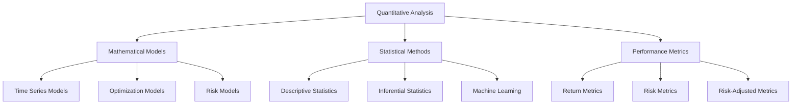

# Quantitative Analysis

## Overview

This section provides detailed documentation on the quantitative analysis aspects of QuantConnect Lean. It covers the mathematical models, statistical methods, and performance metrics used in algorithmic trading strategies.

## Quantitative Components



### 1. Mathematical Models

Mathematical models are used to describe and predict market behavior. They form the foundation of many trading strategies and risk management techniques.

[Learn more about Mathematical Models](./mathematical-models.md)

### 2. Statistical Methods

Statistical methods are used to analyze market data, test hypotheses, and make inferences about market behavior. They help traders understand the relationships between different variables and make data-driven decisions.

[Learn more about Statistical Methods](./statistical-methods.md)

### 3. Performance Metrics

Performance metrics are used to evaluate the performance of trading strategies. They help traders understand the risk and return characteristics of their strategies and make informed decisions about strategy selection and optimization.

[Learn more about Performance Metrics](./performance-metrics.md)

## Quantitative Analysis in Lean

Lean provides several tools and components for quantitative analysis:

### 1. Indicators

Indicators are mathematical transformations of price and volume data. They are used to identify trends, momentum, volatility, and other market characteristics.

```csharp
// Create a Simple Moving Average indicator
var sma = SMA("SPY", 14);

// Create a Relative Strength Index indicator
var rsi = RSI("SPY", 14);

// Create a Bollinger Bands indicator
var bb = BB("SPY", 20, 2);
```

### 2. Consolidators

Consolidators are used to aggregate data from one resolution to another. They are useful for analyzing data at different time scales.

```csharp
// Create a time consolidator
var consolidator = new TradeBarConsolidator(TimeSpan.FromMinutes(5));

// Subscribe to the consolidated data
consolidator.DataConsolidated += OnDataConsolidated;

// Register the consolidator
SubscriptionManager.AddConsolidator("SPY", consolidator);
```

### 3. Statistics

Lean provides various statistical functions for analyzing data and evaluating strategy performance.

```csharp
// Calculate the mean of a series
var mean = data.Mean();

// Calculate the standard deviation of a series
var stdDev = data.StandardDeviation();

// Calculate the correlation between two series
var correlation = Statistics.Correlation(series1, series2);
```

### 4. Optimization

Lean supports parameter optimization to find the best parameters for a trading strategy.

```csharp
// Define the parameter space
var fastPeriod = new OptimizationParameter("FastPeriod", 10, 100, 5);
var slowPeriod = new OptimizationParameter("SlowPeriod", 50, 200, 5);

// Run the optimization
var optimizer = new GridSearchOptimizer();
var results = optimizer.Optimize(
    () => new MyAlgorithm(fastPeriod, slowPeriod),
    new[] { fastPeriod, slowPeriod }
);
```

### 5. Machine Learning

Lean can be integrated with machine learning libraries like scikit-learn, TensorFlow, and PyTorch to develop more sophisticated trading strategies.

```python
# Import machine learning libraries
from sklearn.ensemble import RandomForestClassifier
from sklearn.model_selection import train_test_split

# Prepare the data
X = features
y = labels
X_train, X_test, y_train, y_test = train_test_split(X, y, test_size=0.2)

# Train the model
model = RandomForestClassifier(n_estimators=100)
model.fit(X_train, y_train)

# Make predictions
predictions = model.predict(X_test)
```

## Quantitative Analysis Workflow

The quantitative analysis workflow typically involves the following steps:

1. **Data Collection**: Gather historical market data for analysis.
2. **Data Preprocessing**: Clean and prepare the data for analysis.
3. **Feature Engineering**: Create features that capture relevant market characteristics.
4. **Model Development**: Develop mathematical and statistical models to analyze the data.
5. **Model Validation**: Validate the models using out-of-sample data.
6. **Strategy Development**: Develop trading strategies based on the models.
7. **Strategy Backtesting**: Backtest the strategies using historical data.
8. **Performance Evaluation**: Evaluate the performance of the strategies using various metrics.
9. **Strategy Optimization**: Optimize the strategies to improve performance.
10. **Implementation**: Implement the strategies in a live trading environment.

## Best Practices

### 1. Use Multiple Models

Use multiple models to capture different aspects of market behavior. No single model can capture all market dynamics.

### 2. Validate Models

Validate models using out-of-sample data to ensure they generalize well to new data.

### 3. Consider Model Complexity

Balance model complexity with robustness. More complex models may fit historical data better but may not generalize well to new data.

### 4. Account for Transaction Costs

Include transaction costs in performance evaluations to get a more realistic estimate of strategy performance.

### 5. Monitor Model Performance

Regularly monitor model performance and update models as market conditions change.

## Next Steps

For detailed information about each quantitative component, refer to the individual component documentation:

- [Mathematical Models](./mathematical-models.md)
- [Statistical Methods](./statistical-methods.md)
- [Performance Metrics](./performance-metrics.md)