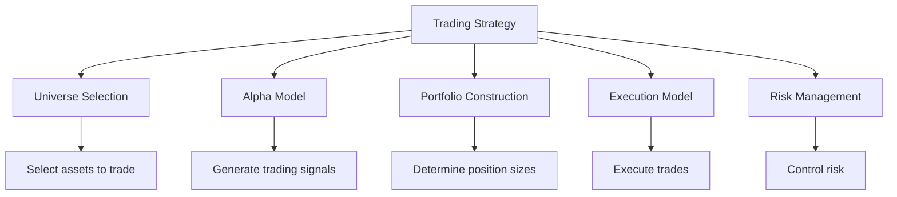

# Strategy Implementation

## Overview

This section provides detailed documentation on implementing trading strategies in QuantConnect Lean. It covers the various components of the Algorithm Framework that are used to build trading strategies, including Alpha Models, Portfolio Construction, Execution Models, and Universe Selection.

## Strategy Components



### 1. Universe Selection

Universe Selection is responsible for selecting the securities that the algorithm will trade. It defines the investment universe - the set of assets that your algorithm can potentially trade.

[Learn more about Universe Selection](./universe-selection.md)

### 2. Alpha Models

Alpha Models are responsible for generating trading signals (insights) based on market data. They analyze market data and produce predictions about future price movements.

[Learn more about Alpha Models](./alpha-models.md)

### 3. Portfolio Construction

Portfolio Construction is responsible for determining position sizes based on insights. It converts the qualitative and quantitative predictions from Alpha Models into target portfolio weights.

[Learn more about Portfolio Construction](./portfolio-construction.md)

### 4. Execution Models

Execution Models are responsible for converting portfolio targets into orders. They determine how to execute trades to achieve the target portfolio, considering factors like market impact, timing, and transaction costs.

[Learn more about Execution Models](./execution-models.md)

## Strategy Implementation Patterns

There are several patterns for implementing trading strategies in Lean:

### 1. Algorithm Framework

The Algorithm Framework is a structured approach to building trading strategies, separating concerns into distinct components. This is the recommended approach for most strategies.

```csharp
public class MyAlgorithm : QCAlgorithm
{
    public override void Initialize()
    {
        SetStartDate(2018, 1, 1);
        SetEndDate(2018, 12, 31);
        SetCash(100000);
        
        // Set up the universe selection model
        SetUniverseSelection(new MyUniverseSelectionModel());
        
        // Set up the alpha model
        SetAlpha(new MyAlphaModel());
        
        // Set up the portfolio construction model
        SetPortfolioConstruction(new MyPortfolioConstructionModel());
        
        // Set up the execution model
        SetExecution(new MyExecutionModel());
        
        // Set up the risk management model
        SetRiskManagement(new MyRiskManagementModel());
    }
}
```

### 2. Traditional Approach

The traditional approach involves implementing the `OnData` method to process market data and make trading decisions. This approach is more flexible but less structured than the Algorithm Framework.

```csharp
public class MyAlgorithm : QCAlgorithm
{
    private SimpleMovingAverage _fast;
    private SimpleMovingAverage _slow;
    
    public override void Initialize()
    {
        SetStartDate(2018, 1, 1);
        SetEndDate(2018, 12, 31);
        SetCash(100000);
        
        // Add securities
        AddEquity("SPY");
        
        // Initialize indicators
        _fast = SMA("SPY", 10);
        _slow = SMA("SPY", 30);
    }
    
    public override void OnData(Slice data)
    {
        // Wait for indicators to be ready
        if (!_fast.IsReady || !_slow.IsReady)
            return;
        
        // Generate trading signals
        if (_fast > _slow && !Portfolio.Invested)
        {
            SetHoldings("SPY", 1.0);
        }
        else if (_fast < _slow && Portfolio.Invested)
        {
            Liquidate();
        }
    }
}
```

### 3. Hybrid Approach

The hybrid approach combines elements of both the Algorithm Framework and the traditional approach. It uses the Algorithm Framework for some components and custom logic in the `OnData` method for others.

```csharp
public class MyAlgorithm : QCAlgorithm
{
    public override void Initialize()
    {
        SetStartDate(2018, 1, 1);
        SetEndDate(2018, 12, 31);
        SetCash(100000);
        
        // Set up the universe selection model
        SetUniverseSelection(new MyUniverseSelectionModel());
        
        // Add securities
        AddEquity("SPY");
    }
    
    public override void OnData(Slice data)
    {
        // Custom trading logic
        if (!Portfolio.Invested)
        {
            SetHoldings("SPY", 1.0);
        }
    }
}
```

## Strategy Development Process

The strategy development process typically involves the following steps:

1. **Define Strategy Objectives**: Define the goals and constraints of the strategy.
2. **Research and Backtest**: Research and backtest the strategy using historical data.
3. **Optimize Parameters**: Optimize the strategy parameters to improve performance.
4. **Validate Strategy**: Validate the strategy using out-of-sample data.
5. **Implement Strategy**: Implement the strategy using the Algorithm Framework or traditional approach.
6. **Monitor and Adjust**: Monitor the strategy's performance and adjust as needed.

## Best Practices

### 1. Separation of Concerns

Separate different aspects of your strategy into distinct components. This makes the strategy more maintainable, testable, and reusable.

### 2. Avoid Overfitting

Be careful not to overfit your strategy to historical data. Use out-of-sample testing and cross-validation to validate your strategy.

### 3. Consider Transaction Costs

Include transaction costs in your backtests to get a more realistic estimate of strategy performance.

### 4. Manage Risk

Implement proper risk management to protect your portfolio from significant drawdowns.

### 5. Test Edge Cases

Test your strategy under various market conditions, including extreme events, to ensure it's robust.

## Next Steps

For detailed information about each strategy component, refer to the individual component documentation:

- [Universe Selection](./universe-selection.md)
- [Alpha Models](./alpha-models.md)
- [Portfolio Construction](./portfolio-construction.md)
- [Execution Models](./execution-models.md)