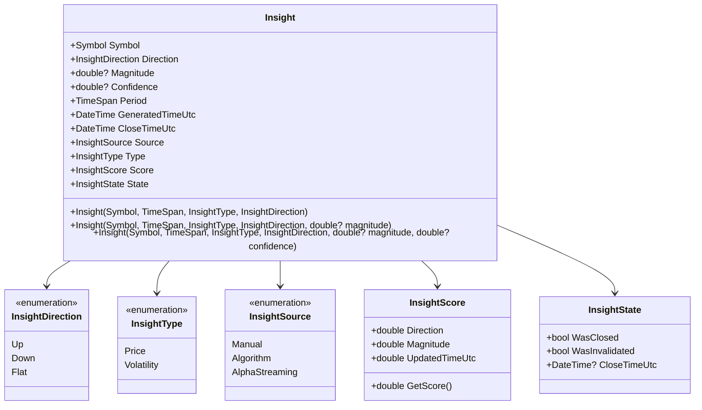
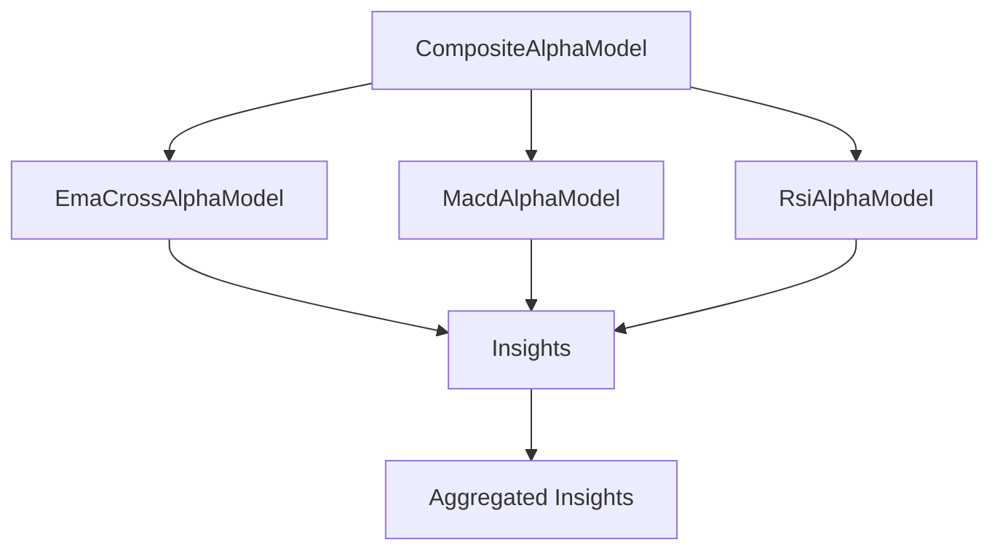
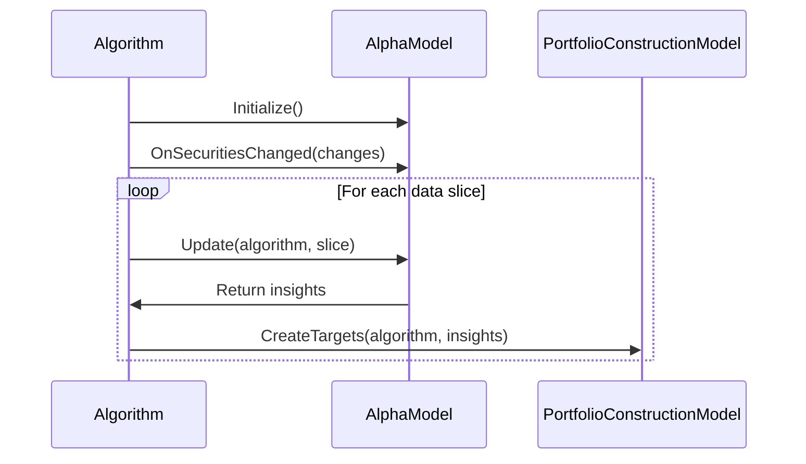

# Alpha Models

## Overview

Alpha Models are a key component of the Algorithm Framework in QuantConnect Lean. They are responsible for generating trading signals (insights) based on market data. Alpha Models analyze market data and produce predictions about future price movements, which are then used by Portfolio Construction Models to determine position sizes.

## What is an Alpha Model?

An Alpha Model is a component that generates trading signals, or "insights," based on market data. These insights represent predictions about future price movements and are used to make trading decisions. In the context of quantitative finance, "alpha" refers to excess returns relative to a benchmark, so an Alpha Model is essentially a model that aims to generate excess returns.

## Alpha Model Interface

All Alpha Models implement the `IAlphaModel` interface:

```csharp
public interface IAlphaModel
{
    IEnumerable<Insight> Update(QCAlgorithm algorithm, Slice data);
    void OnSecuritiesChanged(QCAlgorithm algorithm, SecurityChanges changes);
}
```

### Key Methods

- `Update`: Generates insights based on the latest data
- `OnSecuritiesChanged`: Handles changes to the securities in the algorithm

## Insights

Insights are the output of Alpha Models. They represent predictions about future price movements and have the following properties:

- `Symbol`: The security symbol
- `Direction`: The predicted direction (up, down, or flat)
- `Magnitude`: The predicted magnitude of the move (optional)
- `Confidence`: The confidence level of the prediction (optional)
- `Period`: The time period over which the prediction is valid
- `GeneratedTimeUtc`: The time when the insight was generated
- `CloseTimeUtc`: The time when the insight expires
- `Source`: The source of the insight (e.g., the Alpha Model that generated it)



## Built-in Alpha Models

Lean provides several built-in Alpha Models that can be used out of the box:

### 1. EmaCrossAlphaModel

The EmaCrossAlphaModel generates insights based on EMA (Exponential Moving Average) crossovers. It uses two EMAs with different periods and generates an up insight when the fast EMA crosses above the slow EMA, and a down insight when the fast EMA crosses below the slow EMA.

#### Parameters

- `fastPeriod`: The period of the fast EMA (default: 12)
- `slowPeriod`: The period of the slow EMA (default: 26)
- `resolution`: The resolution of the data (default: Daily)

#### Example

```csharp
// Create an EMA Cross Alpha Model with default parameters
var emaCross = new EmaCrossAlphaModel();

// Create an EMA Cross Alpha Model with custom parameters
var customEmaCross = new EmaCrossAlphaModel(
    fastPeriod: 5,
    slowPeriod: 20,
    resolution: Resolution.Hour
);
```

### 2. MacdAlphaModel

The MacdAlphaModel generates insights based on MACD (Moving Average Convergence Divergence) signals. It generates an up insight when the MACD line crosses above the signal line, and a down insight when the MACD line crosses below the signal line.

#### Parameters

- `fastPeriod`: The period of the fast EMA (default: 12)
- `slowPeriod`: The period of the slow EMA (default: 26)
- `signalPeriod`: The period of the signal line (default: 9)
- `resolution`: The resolution of the data (default: Daily)

#### Example

```csharp
// Create a MACD Alpha Model with default parameters
var macd = new MacdAlphaModel();

// Create a MACD Alpha Model with custom parameters
var customMacd = new MacdAlphaModel(
    fastPeriod: 8,
    slowPeriod: 21,
    signalPeriod: 5,
    resolution: Resolution.Hour
);
```

### 3. RsiAlphaModel

The RsiAlphaModel generates insights based on RSI (Relative Strength Index) signals. It generates an up insight when the RSI crosses below the oversold threshold and then crosses back above it, and a down insight when the RSI crosses above the overbought threshold and then crosses back below it.

#### Parameters

- `period`: The period of the RSI (default: 14)
- `resolution`: The resolution of the data (default: Daily)

#### Example

```csharp
// Create an RSI Alpha Model with default parameters
var rsi = new RsiAlphaModel();

// Create an RSI Alpha Model with custom parameters
var customRsi = new RsiAlphaModel(
    period: 7,
    resolution: Resolution.Hour
);
```

### 4. ConstantAlphaModel

The ConstantAlphaModel generates constant insights for all securities in the universe. It's useful for testing other components of the Algorithm Framework.

#### Parameters

- `direction`: The direction of the insights (default: Up)
- `magnitude`: The magnitude of the insights (default: null)
- `confidence`: The confidence level of the insights (default: null)
- `period`: The period of the insights (default: 1 day)

#### Example

```csharp
// Create a Constant Alpha Model with default parameters
var constant = new ConstantAlphaModel();

// Create a Constant Alpha Model with custom parameters
var customConstant = new ConstantAlphaModel(
    direction: InsightDirection.Down,
    magnitude: 0.1,
    confidence: 0.8,
    period: TimeSpan.FromHours(4)
);
```

### 5. HistoricalReturnsAlphaModel

The HistoricalReturnsAlphaModel generates insights based on historical returns. It calculates the historical return over a specified period and generates an insight with the same direction as the historical return.

#### Parameters

- `period`: The period over which to calculate historical returns (default: 1 day)
- `resolution`: The resolution of the data (default: Daily)

#### Example

```csharp
// Create a Historical Returns Alpha Model with default parameters
var historicalReturns = new HistoricalReturnsAlphaModel();

// Create a Historical Returns Alpha Model with custom parameters
var customHistoricalReturns = new HistoricalReturnsAlphaModel(
    period: TimeSpan.FromDays(5),
    resolution: Resolution.Hour
);
```

### 6. PearsonCorrelationPairsTradingAlphaModel

The PearsonCorrelationPairsTradingAlphaModel generates insights based on pairs trading. It calculates the correlation between pairs of securities and generates insights when the spread between them deviates significantly from its mean.

#### Parameters

- `lookback`: The lookback period for calculating correlation (default: 30 days)
- `resolution`: The resolution of the data (default: Daily)
- `threshold`: The threshold for generating insights (default: 1.0)

#### Example

```csharp
// Create a Pearson Correlation Pairs Trading Alpha Model with default parameters
var pairsTradingAlpha = new PearsonCorrelationPairsTradingAlphaModel();

// Create a Pearson Correlation Pairs Trading Alpha Model with custom parameters
var customPairsTradingAlpha = new PearsonCorrelationPairsTradingAlphaModel(
    lookback: TimeSpan.FromDays(60),
    resolution: Resolution.Hour,
    threshold: 2.0
);
```

## Composite Alpha Model

The CompositeAlphaModel allows you to combine multiple Alpha Models into a single model. It aggregates the insights from all the constituent models.



### Example

```csharp
// Create a Composite Alpha Model with multiple constituent models
var composite = new CompositeAlphaModel(
    new EmaCrossAlphaModel(),
    new MacdAlphaModel(),
    new RsiAlphaModel()
);
```

## Creating Custom Alpha Models

You can create custom Alpha Models by inheriting from the `AlphaModel` base class or implementing the `IAlphaModel` interface:

```csharp
public class MyAlphaModel : AlphaModel
{
    private readonly Dictionary<Symbol, SymbolData> _symbolData;
    
    public MyAlphaModel()
    {
        _symbolData = new Dictionary<Symbol, SymbolData>();
        Name = nameof(MyAlphaModel);
    }
    
    public override IEnumerable<Insight> Update(QCAlgorithm algorithm, Slice data)
    {
        var insights = new List<Insight>();
        
        foreach (var kvp in _symbolData)
        {
            var symbol = kvp.Key;
            var symbolData = kvp.Value;
            
            if (symbolData.Indicator.IsReady)
            {
                var direction = symbolData.Indicator.Current.Value > 0 
                    ? InsightDirection.Up 
                    : InsightDirection.Down;
                
                insights.Add(Insight.Price(
                    symbol,
                    TimeSpan.FromDays(1),
                    direction,
                    magnitude: Math.Abs(symbolData.Indicator.Current.Value),
                    confidence: 0.8
                ));
            }
        }
        
        return insights;
    }
    
    public override void OnSecuritiesChanged(QCAlgorithm algorithm, SecurityChanges changes)
    {
        // Initialize resources for added securities
        foreach (var security in changes.AddedSecurities)
        {
            _symbolData[security.Symbol] = new SymbolData(security.Symbol, algorithm);
        }
        
        // Clean up resources for removed securities
        foreach (var security in changes.RemovedSecurities)
        {
            _symbolData.Remove(security.Symbol);
        }
    }
    
    private class SymbolData
    {
        public Symbol Symbol { get; }
        public CustomIndicator Indicator { get; }
        
        public SymbolData(Symbol symbol, QCAlgorithm algorithm)
        {
            Symbol = symbol;
            Indicator = new CustomIndicator(symbol.Value);
            algorithm.RegisterIndicator(symbol, Indicator, Resolution.Daily);
        }
    }
    
    private class CustomIndicator : IndicatorBase<IndicatorDataPoint>
    {
        public CustomIndicator(string name) : base(name)
        {
        }
        
        protected override decimal ComputeNextValue(IndicatorDataPoint input)
        {
            // Custom indicator logic
            return input.Value;
        }
    }
}
```

## Alpha Model in the Algorithm Framework

To use an Alpha Model in the Algorithm Framework, you need to set it up in your algorithm's `Initialize` method:

```csharp
public class MyAlgorithm : QCAlgorithm
{
    public override void Initialize()
    {
        SetStartDate(2018, 1, 1);
        SetEndDate(2018, 12, 31);
        SetCash(100000);
        
        // Set up the universe selection model
        SetUniverseSelection(new ManualUniverseSelectionModel(
            new[] { "AAPL", "MSFT", "GOOG" }.Select(x => QuantConnect.Symbol.Create(x, SecurityType.Equity, Market.USA)).ToArray()
        ));
        
        // Set up the alpha model
        SetAlpha(new EmaCrossAlphaModel());
        
        // Set up the rest of the framework
        SetPortfolioConstruction(new EqualWeightingPortfolioConstructionModel());
        SetExecution(new ImmediateExecutionModel());
        SetRiskManagement(new NullRiskManagementModel());
    }
}
```

## Alpha Model Workflow

The Alpha Model workflow typically involves the following steps:

1. **Initialize**: The Alpha Model is initialized when the algorithm starts.
2. **OnSecuritiesChanged**: When the universe changes, the Alpha Model is notified through the `OnSecuritiesChanged` method. This allows it to initialize or clean up resources for securities.
3. **Update**: For each data slice, the Alpha Model's `Update` method is called to generate insights.
4. **Insight Processing**: The generated insights are processed by the Portfolio Construction Model to determine position sizes.



## Best Practices

### 1. Keep Alpha Models Simple

Simple Alpha Models are often more robust and less prone to overfitting than complex ones. Start with simple models and add complexity only if necessary.

### 2. Test with Different Parameters

Test your Alpha Models with different parameters to ensure they are robust and not overly sensitive to parameter changes.

### 3. Consider Multiple Time Frames

Consider using multiple time frames in your Alpha Models to capture different market dynamics.

### 4. Combine Multiple Alpha Models

Combine multiple Alpha Models using the CompositeAlphaModel to diversify your signal sources.

### 5. Include Confidence and Magnitude

Include confidence and magnitude in your insights to provide more information to the Portfolio Construction Model.

## Conclusion

Alpha Models are a critical component of the Algorithm Framework in QuantConnect Lean. They generate trading signals (insights) based on market data, which are then used by Portfolio Construction Models to determine position sizes. By understanding and effectively using Alpha Models, you can create more robust and efficient trading strategies.