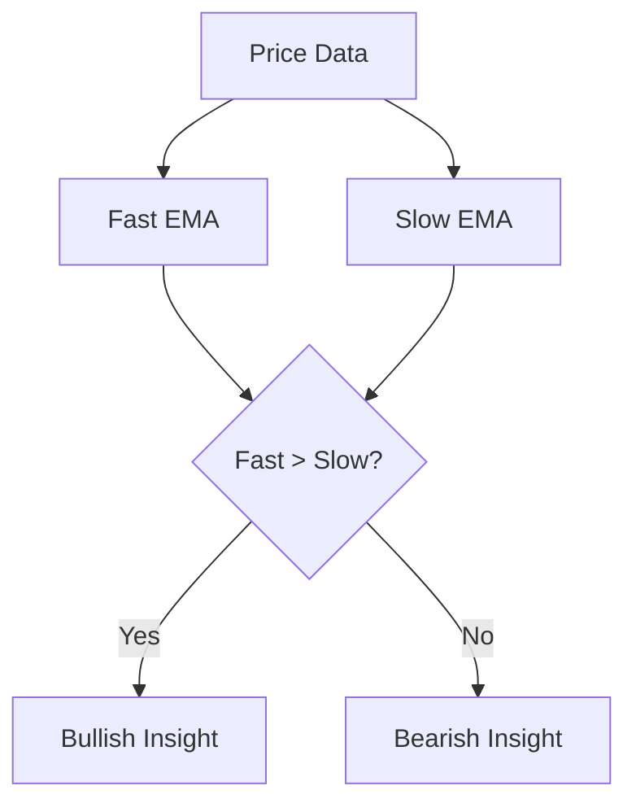
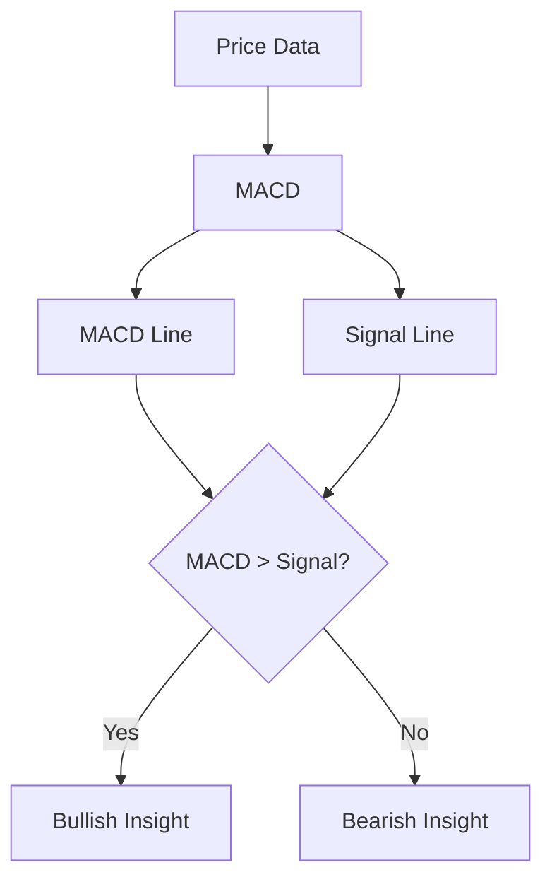
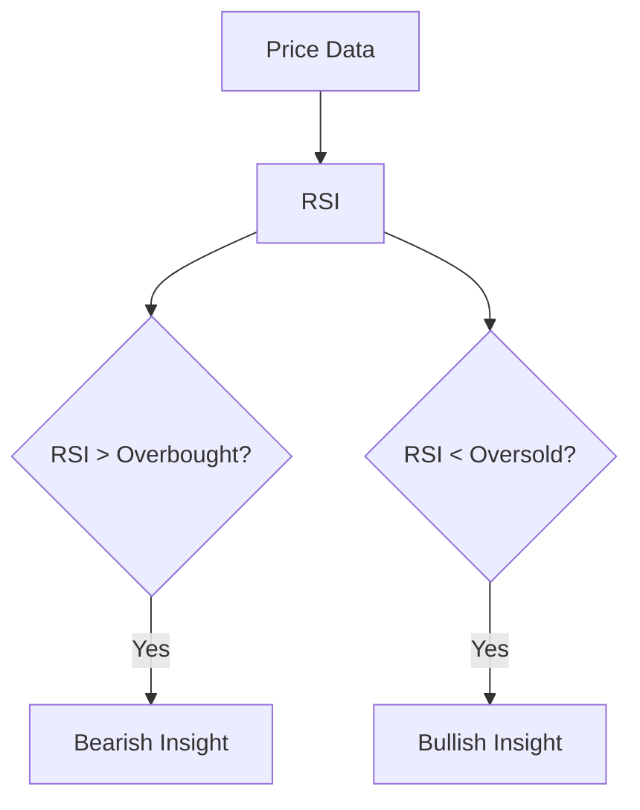
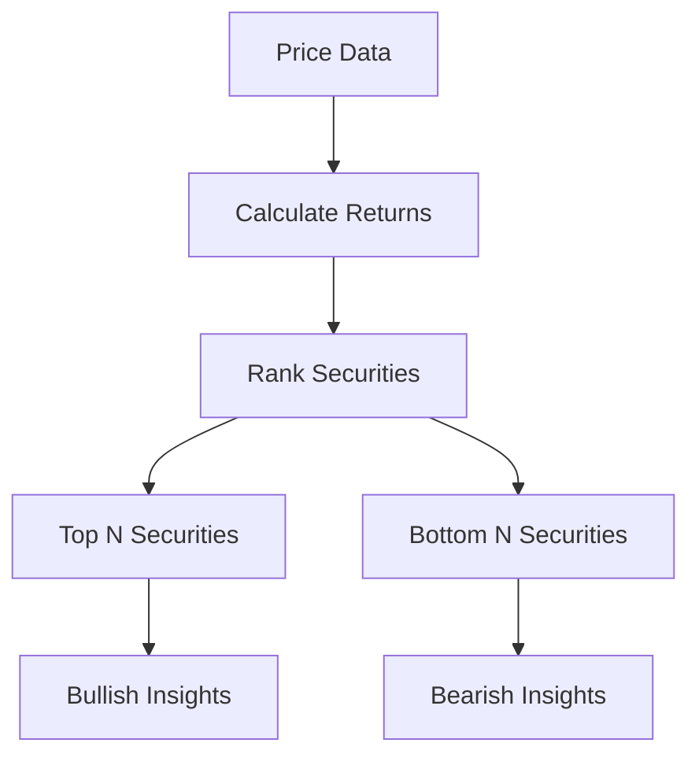
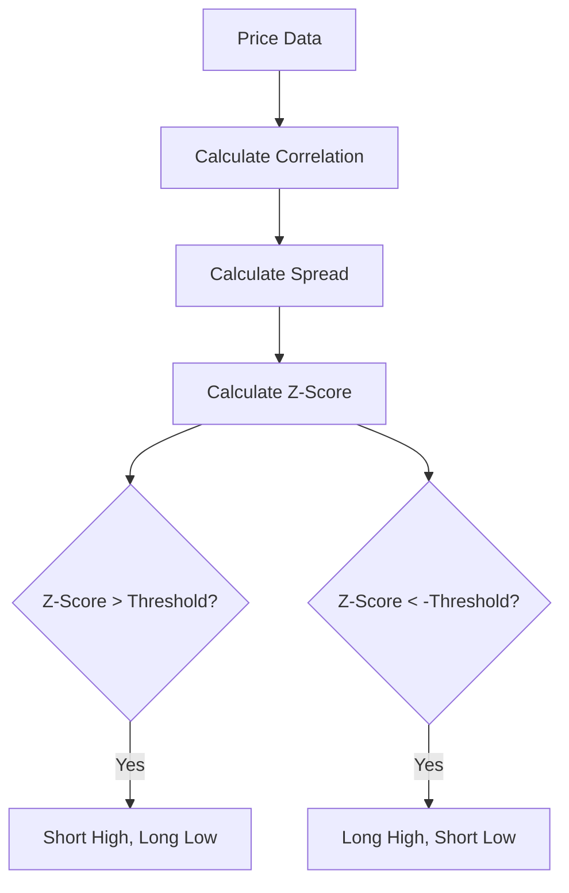

# Alpha Models

## Overview

Alpha Models are a key component of the Algorithm Framework in QuantConnect Lean. They are responsible for generating trading signals, called "insights," based on market data. These insights are then used by Portfolio Construction Models to determine position sizes.

## What is an Alpha Model?

An Alpha Model is a strategy for identifying potential trading opportunities. It analyzes market data and generates predictions about future price movements. These predictions are encapsulated in "Insight" objects, which specify:

- The security (Symbol)
- The direction (Up, Down, or Flat)
- The forecast period (how long the prediction is valid)
- The magnitude (strength of the prediction)
- The confidence (certainty of the prediction)

## Alpha Model Interface

All Alpha Models implement the `IAlphaModel` interface:

```csharp
public interface IAlphaModel
{
    IEnumerable<Insight> Update(QCAlgorithm algorithm, Slice data);
    void OnSecuritiesChanged(QCAlgorithm algorithm, SecurityChanges changes);
}
```

### Key Methods

- `Update`: Called each time the algorithm receives new data. It analyzes the data and generates insights.
- `OnSecuritiesChanged`: Called when the securities in the algorithm change. It allows the alpha model to initialize or clean up resources for securities.

## Built-in Alpha Models

QuantConnect Lean provides several built-in Alpha Models that can be used out of the box:

### 1. EmaCrossAlphaModel

The EmaCrossAlphaModel generates insights based on Exponential Moving Average (EMA) crossovers. It uses two EMAs, a fast EMA and a slow EMA, and generates insights when they cross.



#### Parameters

- `fastPeriod`: The period of the fast EMA (default: 12)
- `slowPeriod`: The period of the slow EMA (default: 26)
- `resolution`: The resolution of data to use (default: Daily)

#### Example

```csharp
// Create an EMA Cross Alpha Model with default parameters
var emaCross = new EmaCrossAlphaModel();

// Create an EMA Cross Alpha Model with custom parameters
var customEmaCross = new EmaCrossAlphaModel(
    fastPeriod: 5,
    slowPeriod: 20,
    resolution: Resolution.Hour
);
```

#### Implementation Details

The EmaCrossAlphaModel maintains two EMA indicators for each security. When the fast EMA crosses above the slow EMA, it generates a bullish insight. When the fast EMA crosses below the slow EMA, it generates a bearish insight.

```csharp
public override IEnumerable<Insight> Update(QCAlgorithm algorithm, Slice data)
{
    var insights = new List<Insight>();
    foreach (var symbolData in SymbolDataBySymbol.Values)
    {
        if (symbolData.Fast.IsReady && symbolData.Slow.IsReady)
        {
            var insightPeriod = _resolution.ToTimeSpan().Multiply(_predictionInterval);
            if (symbolData.FastIsOverSlow)
            {
                if (symbolData.Slow > symbolData.Fast)
                {
                    insights.Add(Insight.Price(symbolData.Symbol, insightPeriod, InsightDirection.Down));
                }
            }
            else if (symbolData.SlowIsOverFast)
            {
                if (symbolData.Fast > symbolData.Slow)
                {
                    insights.Add(Insight.Price(symbolData.Symbol, insightPeriod, InsightDirection.Up));
                }
            }
        }

        symbolData.FastIsOverSlow = symbolData.Fast > symbolData.Slow;
    }

    return insights;
}
```

### 2. MacdAlphaModel

The MacdAlphaModel generates insights based on the Moving Average Convergence Divergence (MACD) indicator. It generates insights when the MACD line crosses the signal line.



#### Parameters

- `fastPeriod`: The period of the fast EMA used in MACD calculation (default: 12)
- `slowPeriod`: The period of the slow EMA used in MACD calculation (default: 26)
- `signalPeriod`: The period of the signal line (default: 9)
- `movingAverageType`: The type of moving average to use (default: ExponentialMovingAverage)
- `resolution`: The resolution of data to use (default: Daily)

#### Example

```csharp
// Create a MACD Alpha Model with default parameters
var macd = new MacdAlphaModel();

// Create a MACD Alpha Model with custom parameters
var customMacd = new MacdAlphaModel(
    fastPeriod: 8,
    slowPeriod: 21,
    signalPeriod: 5,
    movingAverageType: MovingAverageType.Simple,
    resolution: Resolution.Hour
);
```

#### Implementation Details

The MacdAlphaModel maintains a MACD indicator for each security. When the MACD line crosses above the signal line, it generates a bullish insight. When the MACD line crosses below the signal line, it generates a bearish insight.

### 3. RsiAlphaModel

The RsiAlphaModel generates insights based on the Relative Strength Index (RSI) indicator. It generates insights when the RSI crosses predefined overbought and oversold levels.



#### Parameters

- `period`: The period of the RSI (default: 14)
- `resolution`: The resolution of data to use (default: Daily)

#### Example

```csharp
// Create an RSI Alpha Model with default parameters
var rsi = new RsiAlphaModel();

// Create an RSI Alpha Model with custom parameters
var customRsi = new RsiAlphaModel(
    period: 7,
    resolution: Resolution.Hour
);
```

#### Implementation Details

The RsiAlphaModel maintains an RSI indicator for each security. When the RSI crosses above the overbought level (typically 70), it generates a bearish insight. When the RSI crosses below the oversold level (typically 30), it generates a bullish insight.

### 4. ConstantAlphaModel

The ConstantAlphaModel generates constant insights for all securities. It's useful for testing and as a baseline for comparison.

#### Parameters

- `direction`: The direction of the insights (default: InsightDirection.Up)
- `magnitude`: The magnitude of the insights (default: null)
- `confidence`: The confidence of the insights (default: null)
- `period`: The period of the insights (default: TimeSpan.FromDays(1))

#### Example

```csharp
// Create a Constant Alpha Model with default parameters
var constant = new ConstantAlphaModel();

// Create a Constant Alpha Model with custom parameters
var customConstant = new ConstantAlphaModel(
    direction: InsightDirection.Down,
    magnitude: 0.1m,
    confidence: 0.8m,
    period: TimeSpan.FromHours(4)
);
```

#### Implementation Details

The ConstantAlphaModel generates the same insight for all securities in the algorithm. It's primarily used for testing and as a baseline for comparison.

### 5. HistoricalReturnsAlphaModel

The HistoricalReturnsAlphaModel generates insights based on historical returns. It assumes that securities with high historical returns will continue to perform well, and vice versa.



#### Parameters

- `lookback`: The number of periods to look back (default: 1)
- `resolution`: The resolution of data to use (default: Daily)
- `numberOfInsights`: The number of insights to generate (default: null, which means all securities)

#### Example

```csharp
// Create a Historical Returns Alpha Model with default parameters
var historicalReturns = new HistoricalReturnsAlphaModel();

// Create a Historical Returns Alpha Model with custom parameters
var customHistoricalReturns = new HistoricalReturnsAlphaModel(
    lookback: 5,
    resolution: Resolution.Hour,
    numberOfInsights: 10
);
```

#### Implementation Details

The HistoricalReturnsAlphaModel calculates the returns of each security over the lookback period. It then ranks the securities by their returns and generates bullish insights for the top performers and bearish insights for the bottom performers.

### 6. PearsonCorrelationPairsTradingAlphaModel

The PearsonCorrelationPairsTradingAlphaModel generates insights based on pairs trading. It identifies pairs of securities that are historically correlated and generates insights when their relationship deviates from the norm.



#### Parameters

- `lookback`: The number of periods to look back for correlation calculation (default: 30)
- `resolution`: The resolution of data to use (default: Daily)
- `threshold`: The z-score threshold for generating insights (default: 1.0)

#### Example

```csharp
// Create a Pairs Trading Alpha Model with default parameters
var pairsTrading = new PearsonCorrelationPairsTradingAlphaModel();

// Create a Pairs Trading Alpha Model with custom parameters
var customPairsTrading = new PearsonCorrelationPairsTradingAlphaModel(
    lookback: 60,
    resolution: Resolution.Hour,
    threshold: 2.0
);
```

#### Implementation Details

The PearsonCorrelationPairsTradingAlphaModel calculates the correlation between pairs of securities. For highly correlated pairs, it calculates the spread between them and the z-score of the spread. When the z-score exceeds the threshold, it generates insights to short the higher-priced security and long the lower-priced security, or vice versa.

## Creating Custom Alpha Models

You can create custom Alpha Models by inheriting from the `AlphaModel` base class or implementing the `IAlphaModel` interface:

```csharp
public class MyAlphaModel : AlphaModel
{
    private readonly Dictionary<Symbol, SymbolData> _symbolData;

    public MyAlphaModel()
    {
        _symbolData = new Dictionary<Symbol, SymbolData>();
        Name = nameof(MyAlphaModel);
    }

    public override IEnumerable<Insight> Update(QCAlgorithm algorithm, Slice data)
    {
        var insights = new List<Insight>();
        foreach (var kvp in _symbolData)
        {
            var symbol = kvp.Key;
            var symbolData = kvp.Value;
            
            // Your custom logic to generate insights
            if (/* your condition */)
            {
                insights.Add(Insight.Price(symbol, TimeSpan.FromDays(1), InsightDirection.Up));
            }
            else if (/* your condition */)
            {
                insights.Add(Insight.Price(symbol, TimeSpan.FromDays(1), InsightDirection.Down));
            }
        }
        return insights;
    }

    public override void OnSecuritiesChanged(QCAlgorithm algorithm, SecurityChanges changes)
    {
        foreach (var security in changes.AddedSecurities)
        {
            _symbolData[security.Symbol] = new SymbolData(security.Symbol, algorithm);
        }
        foreach (var security in changes.RemovedSecurities)
        {
            _symbolData.Remove(security.Symbol);
        }
    }

    private class SymbolData
    {
        public Symbol Symbol { get; }
        // Your custom indicators or data

        public SymbolData(Symbol symbol, QCAlgorithm algorithm)
        {
            Symbol = symbol;
            // Initialize your custom indicators or data
        }
    }
}
```

## Composite Alpha Model

The CompositeAlphaModel allows you to combine multiple Alpha Models into a single model. This is useful for creating more robust strategies that use multiple signals.

```csharp
// Create a Composite Alpha Model with multiple Alpha Models
var composite = new CompositeAlphaModel(
    new EmaCrossAlphaModel(),
    new RsiAlphaModel(),
    new MacdAlphaModel()
);
```

The CompositeAlphaModel calls the `Update` method of each constituent Alpha Model and combines their insights. By default, it simply concatenates the insights from all models, but you can customize this behavior by overriding the `CombineInsights` method.

## Best Practices

### 1. Use Appropriate Time Frames

Choose the right time frame for your Alpha Model based on your trading strategy. Shorter time frames are suitable for high-frequency trading, while longer time frames are better for swing trading or position trading.

### 2. Combine Multiple Signals

Use the CompositeAlphaModel to combine multiple signals for more robust strategies. This can help reduce false signals and improve performance.

### 3. Consider Market Conditions

Different Alpha Models perform better in different market conditions. Consider using adaptive strategies that switch between Alpha Models based on market conditions.

### 4. Backtest Thoroughly

Backtest your Alpha Models thoroughly to ensure they perform well in different market conditions. Use the Lean backtesting engine to test your models over different time periods and with different securities.

### 5. Monitor Performance

Monitor the performance of your Alpha Models in live trading. Keep track of metrics such as win rate, profit factor, and drawdown to ensure your models are performing as expected.

## Conclusion

Alpha Models are a key component of the Algorithm Framework in QuantConnect Lean. They generate trading signals based on market data, which are then used by Portfolio Construction Models to determine position sizes. By understanding and effectively using Alpha Models, you can create more robust and profitable trading strategies.