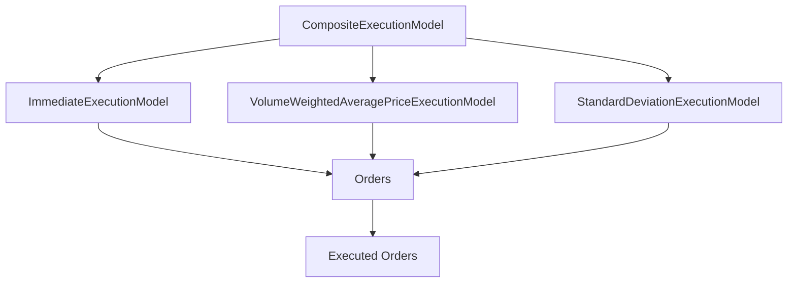
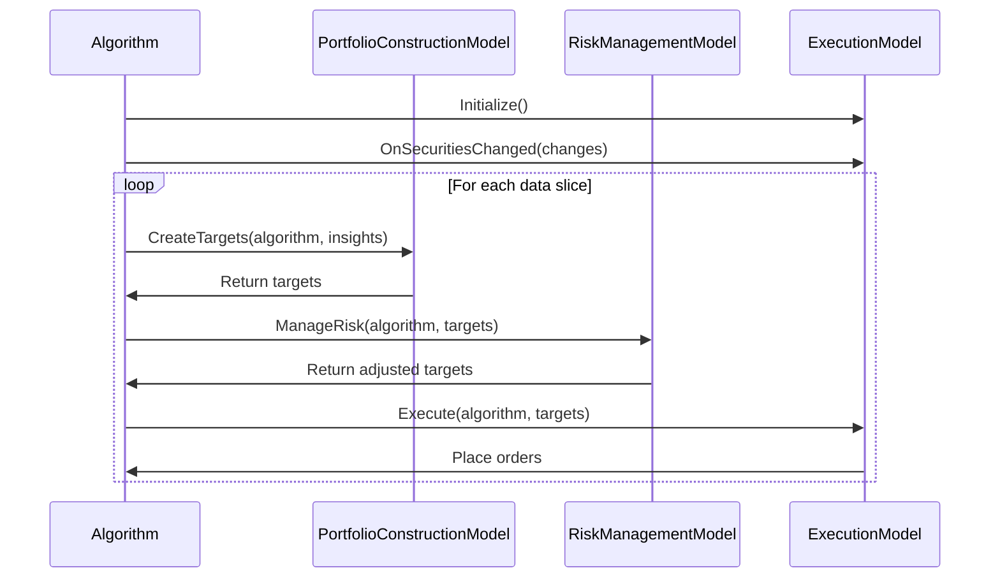

# Execution Models

## Overview

Execution Models are a key component of the Algorithm Framework in QuantConnect Lean. They are responsible for converting portfolio targets into orders. Execution Models determine how to execute trades to achieve the target portfolio, considering factors like market impact, timing, and transaction costs.

## What is an Execution Model?

An Execution Model is a component that converts portfolio targets into orders. It determines the optimal way to execute trades to achieve the target portfolio. Execution Models can implement various execution strategies, such as immediate execution, volume-weighted average price (VWAP), time-weighted average price (TWAP), and implementation shortfall.

## Execution Model Interface

All Execution Models implement the `IExecutionModel` interface:

```csharp
public interface IExecutionModel
{
    void Execute(QCAlgorithm algorithm, IPortfolioTarget[] targets);
    void OnSecuritiesChanged(QCAlgorithm algorithm, SecurityChanges changes);
}
```

### Key Methods

- `Execute`: Executes orders to achieve the portfolio targets
- `OnSecuritiesChanged`: Handles changes to the securities in the algorithm

## Built-in Execution Models

Lean provides several built-in Execution Models that can be used out of the box:

### 1. ImmediateExecutionModel

The ImmediateExecutionModel immediately executes orders to achieve the target portfolio. It's the simplest execution model and is useful for strategies that don't require sophisticated execution.

#### Example

```csharp
// Create an Immediate Execution Model
var immediateExecution = new ImmediateExecutionModel();
```

### 2. VolumeWeightedAveragePriceExecutionModel

The VolumeWeightedAveragePriceExecutionModel executes orders using a VWAP strategy. It aims to execute orders at a price close to the volume-weighted average price over a specified period.

#### Parameters

- `period`: The period over which to execute the VWAP (default: 1 day)

#### Example

```csharp
// Create a VWAP Execution Model with default parameters
var vwap = new VolumeWeightedAveragePriceExecutionModel();

// Create a VWAP Execution Model with custom parameters
var customVwap = new VolumeWeightedAveragePriceExecutionModel(
    period: TimeSpan.FromHours(4)
);
```

### 3. StandardDeviationExecutionModel

The StandardDeviationExecutionModel executes orders based on price movements relative to a standard deviation band. It aims to execute orders at favorable prices by waiting for price movements within a standard deviation range.

#### Parameters

- `period`: The period over which to calculate standard deviation (default: 60 days)
- `deviations`: The number of standard deviations to use (default: 1.0)

#### Example

```csharp
// Create a Standard Deviation Execution Model with default parameters
var standardDeviation = new StandardDeviationExecutionModel();

// Create a Standard Deviation Execution Model with custom parameters
var customStandardDeviation = new StandardDeviationExecutionModel(
    period: TimeSpan.FromDays(30),
    deviations: 2.0
);
```

### 4. SpreadExecutionModel

The SpreadExecutionModel executes orders based on the bid-ask spread. It aims to execute orders at favorable prices by waiting for the spread to narrow.

#### Parameters

- `minimumOrderMarginPercentage`: The minimum margin percentage for an order to be executed (default: 0.5%)
- `maximumOrderMarginPercentage`: The maximum margin percentage for an order to be executed (default: 2.0%)

#### Example

```csharp
// Create a Spread Execution Model with default parameters
var spread = new SpreadExecutionModel();

// Create a Spread Execution Model with custom parameters
var customSpread = new SpreadExecutionModel(
    minimumOrderMarginPercentage: 0.3,
    maximumOrderMarginPercentage: 1.5
);
```

## Composite Execution Model

The CompositeExecutionModel allows you to combine multiple Execution Models into a single model. It executes orders using all the constituent models.



### Example

```csharp
// Create a Composite Execution Model with multiple constituent models
var composite = new CompositeExecutionModel(
    new ImmediateExecutionModel(),
    new VolumeWeightedAveragePriceExecutionModel(),
    new StandardDeviationExecutionModel()
);
```

## Creating Custom Execution Models

You can create custom Execution Models by inheriting from the `ExecutionModel` base class or implementing the `IExecutionModel` interface:

```csharp
public class MyExecutionModel : ExecutionModel
{
    private readonly Dictionary<Symbol, SymbolData> _symbolData;
    
    public MyExecutionModel()
    {
        _symbolData = new Dictionary<Symbol, SymbolData>();
        Name = nameof(MyExecutionModel);
    }
    
    public override void Execute(QCAlgorithm algorithm, IPortfolioTarget[] targets)
    {
        // Skip if there are no targets
        if (targets.Length == 0)
        {
            return;
        }
        
        // Process each target
        foreach (var target in targets)
        {
            var symbol = target.Symbol;
            
            // Skip if we don't have data for this symbol
            if (!_symbolData.ContainsKey(symbol))
            {
                continue;
            }
            
            var security = algorithm.Securities[symbol];
            var symbolData = _symbolData[symbol];
            
            // Calculate the order quantity
            var holding = algorithm.Portfolio[symbol];
            var targetQuantity = target.Quantity;
            var currentQuantity = holding.Quantity;
            var deltaQuantity = targetQuantity - currentQuantity;
            
            // Skip if the delta is too small
            if (Math.Abs(deltaQuantity) < 0.01m)
            {
                continue;
            }
            
            // Check if we should execute the order
            if (ShouldExecute(algorithm, security, symbolData, deltaQuantity))
            {
                // Place the order
                algorithm.MarketOrder(symbol, deltaQuantity);
                
                // Update the symbol data
                symbolData.LastOrderTime = algorithm.Time;
            }
        }
    }
    
    public override void OnSecuritiesChanged(QCAlgorithm algorithm, SecurityChanges changes)
    {
        // Initialize data for added securities
        foreach (var security in changes.AddedSecurities)
        {
            _symbolData[security.Symbol] = new SymbolData(security.Symbol);
        }
        
        // Clean up data for removed securities
        foreach (var security in changes.RemovedSecurities)
        {
            _symbolData.Remove(security.Symbol);
        }
    }
    
    private bool ShouldExecute(QCAlgorithm algorithm, Security security, SymbolData symbolData, decimal deltaQuantity)
    {
        // Custom execution logic
        // For example, only execute if it's been at least 1 hour since the last order
        return algorithm.Time - symbolData.LastOrderTime >= TimeSpan.FromHours(1);
    }
    
    private class SymbolData
    {
        public Symbol Symbol { get; }
        public DateTime LastOrderTime { get; set; }
        
        public SymbolData(Symbol symbol)
        {
            Symbol = symbol;
            LastOrderTime = DateTime.MinValue;
        }
    }
}
```

## Execution Model in the Algorithm Framework

To use an Execution Model in the Algorithm Framework, you need to set it up in your algorithm's `Initialize` method:

```csharp
public class MyAlgorithm : QCAlgorithm
{
    public override void Initialize()
    {
        SetStartDate(2018, 1, 1);
        SetEndDate(2018, 12, 31);
        SetCash(100000);
        
        // Set up the universe selection model
        SetUniverseSelection(new ManualUniverseSelectionModel(
            new[] { "AAPL", "MSFT", "GOOG" }.Select(x => QuantConnect.Symbol.Create(x, SecurityType.Equity, Market.USA)).ToArray()
        ));
        
        // Set up the alpha model
        SetAlpha(new EmaCrossAlphaModel());
        
        // Set up the portfolio construction model
        SetPortfolioConstruction(new EqualWeightingPortfolioConstructionModel());
        
        // Set up the execution model
        SetExecution(new ImmediateExecutionModel());
        
        // Set up the risk management model
        SetRiskManagement(new NullRiskManagementModel());
    }
}
```

## Execution Model Workflow

The Execution Model workflow typically involves the following steps:

1. **Initialize**: The Execution Model is initialized when the algorithm starts.
2. **OnSecuritiesChanged**: When the universe changes, the Execution Model is notified through the `OnSecuritiesChanged` method. This allows it to initialize or clean up resources for securities.
3. **Execute**: When new portfolio targets are generated by the Portfolio Construction Model and processed by the Risk Management Model, the Execution Model's `Execute` method is called to place orders.



## Execution Strategies

### 1. Market Orders

Market orders are the simplest form of execution. They are executed immediately at the current market price. They are useful for strategies that prioritize execution speed over price.

```csharp
// Place a market order
algorithm.MarketOrder(symbol, quantity);
```

### 2. Limit Orders

Limit orders are executed at a specified price or better. They are useful for strategies that prioritize price over execution speed.

```csharp
// Place a limit order
algorithm.LimitOrder(symbol, quantity, limitPrice);
```

### 3. Stop Orders

Stop orders are executed when the price reaches a specified stop price. They are useful for implementing stop-loss strategies.

```csharp
// Place a stop order
algorithm.StopMarketOrder(symbol, quantity, stopPrice);
```

### 4. Stop-Limit Orders

Stop-limit orders combine features of stop orders and limit orders. They are triggered when the price reaches a specified stop price, but are executed as limit orders at a specified limit price.

```csharp
// Place a stop-limit order
algorithm.StopLimitOrder(symbol, quantity, stopPrice, limitPrice);
```

### 5. Volume-Weighted Average Price (VWAP)

VWAP execution aims to execute orders at a price close to the volume-weighted average price over a specified period. It's useful for large orders that might impact the market.

```csharp
// Implement VWAP execution
public class VwapExecutionModel : ExecutionModel
{
    private readonly TimeSpan _period;
    
    public VwapExecutionModel(TimeSpan period)
    {
        _period = period;
    }
    
    public override void Execute(QCAlgorithm algorithm, IPortfolioTarget[] targets)
    {
        foreach (var target in targets)
        {
            var symbol = target.Symbol;
            var security = algorithm.Securities[symbol];
            
            // Calculate the order quantity
            var holding = algorithm.Portfolio[symbol];
            var targetQuantity = target.Quantity;
            var currentQuantity = holding.Quantity;
            var deltaQuantity = targetQuantity - currentQuantity;
            
            // Skip if the delta is too small
            if (Math.Abs(deltaQuantity) < 0.01m)
            {
                continue;
            }
            
            // Calculate the VWAP price
            var history = algorithm.History(symbol, _period, Resolution.Minute);
            var vwap = history.Sum(x => x.Volume * x.Close) / history.Sum(x => x.Volume);
            
            // Place a limit order at the VWAP price
            algorithm.LimitOrder(symbol, deltaQuantity, vwap);
        }
    }
}
```

### 6. Time-Weighted Average Price (TWAP)

TWAP execution aims to execute orders at a price close to the time-weighted average price over a specified period. It breaks a large order into smaller orders executed at regular intervals.

```csharp
// Implement TWAP execution
public class TwapExecutionModel : ExecutionModel
{
    private readonly TimeSpan _period;
    private readonly int _slices;
    private readonly Dictionary<Symbol, TwapData> _twapData;
    
    public TwapExecutionModel(TimeSpan period, int slices)
    {
        _period = period;
        _slices = slices;
        _twapData = new Dictionary<Symbol, TwapData>();
    }
    
    public override void Execute(QCAlgorithm algorithm, IPortfolioTarget[] targets)
    {
        foreach (var target in targets)
        {
            var symbol = target.Symbol;
            
            // Skip if we don't have data for this symbol
            if (!_twapData.ContainsKey(symbol))
            {
                continue;
            }
            
            var twapData = _twapData[symbol];
            
            // Calculate the order quantity
            var holding = algorithm.Portfolio[symbol];
            var targetQuantity = target.Quantity;
            var currentQuantity = holding.Quantity;
            var deltaQuantity = targetQuantity - currentQuantity;
            
            // Skip if the delta is too small
            if (Math.Abs(deltaQuantity) < 0.01m)
            {
                continue;
            }
            
            // Update the TWAP data
            twapData.TargetQuantity = targetQuantity;
            twapData.StartTime = algorithm.Time;
            twapData.EndTime = algorithm.Time + _period;
            twapData.SliceSize = deltaQuantity / _slices;
            twapData.SlicesExecuted = 0;
            
            // Execute the first slice
            ExecuteSlice(algorithm, symbol, twapData);
        }
    }
    
    public override void OnSecuritiesChanged(QCAlgorithm algorithm, SecurityChanges changes)
    {
        // Initialize data for added securities
        foreach (var security in changes.AddedSecurities)
        {
            _twapData[security.Symbol] = new TwapData();
        }
        
        // Clean up data for removed securities
        foreach (var security in changes.RemovedSecurities)
        {
            _twapData.Remove(security.Symbol);
        }
    }
    
    private void ExecuteSlice(QCAlgorithm algorithm, Symbol symbol, TwapData twapData)
    {
        // Skip if all slices have been executed
        if (twapData.SlicesExecuted >= _slices)
        {
            return;
        }
        
        // Calculate the slice quantity
        var sliceQuantity = twapData.SliceSize;
        
        // Place the order
        algorithm.MarketOrder(symbol, sliceQuantity);
        
        // Update the TWAP data
        twapData.SlicesExecuted++;
        
        // Schedule the next slice
        if (twapData.SlicesExecuted < _slices)
        {
            var timeUntilEnd = twapData.EndTime - algorithm.Time;
            var timePerRemainingSlice = timeUntilEnd / (_slices - twapData.SlicesExecuted);
            var nextSliceTime = algorithm.Time + timePerRemainingSlice;
            
            algorithm.Schedule.On(nextSliceTime, () => ExecuteSlice(algorithm, symbol, twapData));
        }
    }
    
    private class TwapData
    {
        public decimal TargetQuantity { get; set; }
        public DateTime StartTime { get; set; }
        public DateTime EndTime { get; set; }
        public decimal SliceSize { get; set; }
        public int SlicesExecuted { get; set; }
    }
}
```

### 7. Implementation Shortfall

Implementation shortfall execution aims to minimize the difference between the decision price (the price at the time the decision to trade was made) and the execution price. It's useful for strategies that are sensitive to price movements.

```csharp
// Implement Implementation Shortfall execution
public class ImplementationShortfallExecutionModel : ExecutionModel
{
    private readonly Dictionary<Symbol, decimal> _decisionPrices;
    
    public ImplementationShortfallExecutionModel()
    {
        _decisionPrices = new Dictionary<Symbol, decimal>();
    }
    
    public override void Execute(QCAlgorithm algorithm, IPortfolioTarget[] targets)
    {
        foreach (var target in targets)
        {
            var symbol = target.Symbol;
            var security = algorithm.Securities[symbol];
            
            // Calculate the order quantity
            var holding = algorithm.Portfolio[symbol];
            var targetQuantity = target.Quantity;
            var currentQuantity = holding.Quantity;
            var deltaQuantity = targetQuantity - currentQuantity;
            
            // Skip if the delta is too small
            if (Math.Abs(deltaQuantity) < 0.01m)
            {
                continue;
            }
            
            // Record the decision price if we don't have one
            if (!_decisionPrices.ContainsKey(symbol))
            {
                _decisionPrices[symbol] = security.Price;
            }
            
            // Calculate the implementation shortfall
            var decisionPrice = _decisionPrices[symbol];
            var currentPrice = security.Price;
            var shortfall = currentPrice - decisionPrice;
            
            // Adjust the limit price based on the shortfall
            var limitPrice = currentPrice;
            if (deltaQuantity > 0 && shortfall > 0)
            {
                // If buying and price has increased, use a limit price to avoid paying too much
                limitPrice = decisionPrice * 1.01m; // Allow 1% slippage
            }
            else if (deltaQuantity < 0 && shortfall < 0)
            {
                // If selling and price has decreased, use a limit price to avoid selling too low
                limitPrice = decisionPrice * 0.99m; // Allow 1% slippage
            }
            
            // Place the order
            algorithm.LimitOrder(symbol, deltaQuantity, limitPrice);
            
            // Reset the decision price
            _decisionPrices.Remove(symbol);
        }
    }
}
```

## Execution Considerations

### 1. Market Impact

Market impact refers to the effect of a trade on the market price. Large orders can move the market, resulting in worse execution prices. Execution Models should consider market impact when determining how to execute trades.

### 2. Timing

Timing refers to when trades are executed. Some markets have specific times of day with higher liquidity or lower volatility, which can affect execution quality. Execution Models should consider timing when determining when to execute trades.

### 3. Transaction Costs

Transaction costs include commissions, fees, and slippage. They can significantly impact strategy performance, especially for high-frequency strategies. Execution Models should consider transaction costs when determining how to execute trades.

### 4. Liquidity

Liquidity refers to the ease with which a security can be bought or sold without affecting its price. Illiquid securities can be difficult to trade and may have higher transaction costs. Execution Models should consider liquidity when determining how to execute trades.

### 5. Order Types

Different order types (market, limit, stop, etc.) have different characteristics and are suitable for different situations. Execution Models should choose the appropriate order type based on the execution strategy and market conditions.

## Best Practices

### 1. Consider Market Impact

For large orders, consider using execution strategies that minimize market impact, such as VWAP or TWAP.

### 2. Use Limit Orders

When possible, use limit orders to avoid paying the spread and to get better execution prices.

### 3. Monitor Execution Quality

Regularly monitor execution quality metrics, such as slippage and fill rates, to ensure your execution strategy is effective.

### 4. Adapt to Market Conditions

Adapt your execution strategy to current market conditions, such as volatility and liquidity.

### 5. Test Different Execution Models

Test different Execution Models to find the one that works best for your strategy.

## Conclusion

Execution Models are a critical component of the Algorithm Framework in QuantConnect Lean. They convert portfolio targets into orders, determining how to execute trades to achieve the target portfolio. By understanding and effectively using Execution Models, you can improve the performance of your trading strategies by reducing transaction costs and market impact.