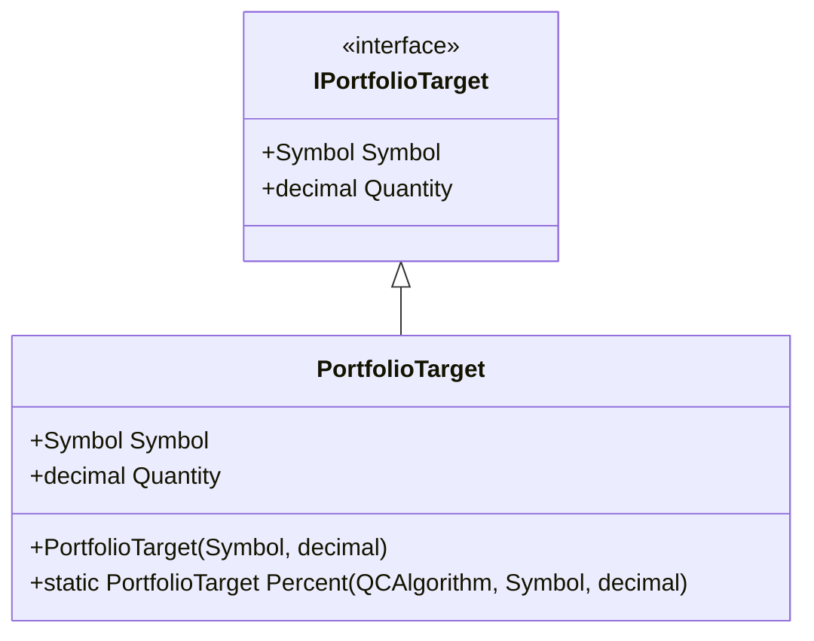
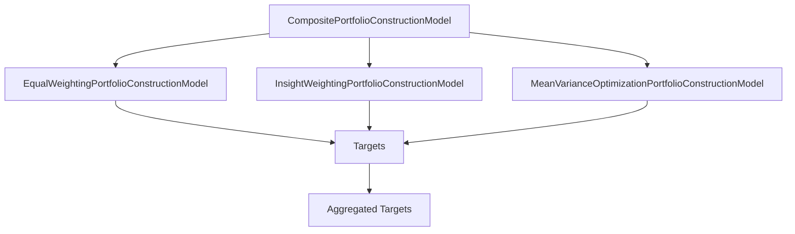
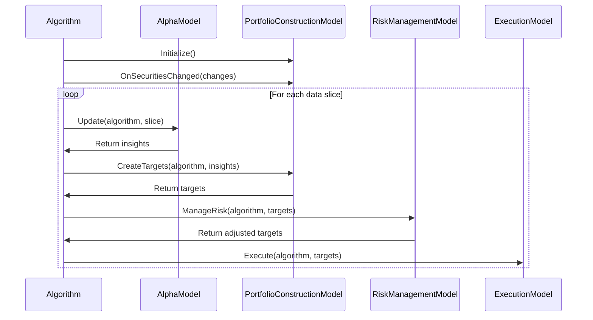

# Portfolio Construction

## Overview

Portfolio Construction is a critical component of the Algorithm Framework in QuantConnect Lean. It is responsible for determining position sizes based on insights generated by Alpha Models. Portfolio Construction Models convert the qualitative and quantitative predictions from Alpha Models into target portfolio weights, which are then used by Execution Models to place orders.

## What is Portfolio Construction?

Portfolio Construction is the process of determining how to allocate capital across different securities in a portfolio. It involves deciding which securities to include in the portfolio and how much capital to allocate to each security. In the context of the Algorithm Framework, Portfolio Construction Models take insights from Alpha Models and convert them into target portfolio weights.

## Portfolio Construction Interface

All Portfolio Construction Models implement the `IPortfolioConstructionModel` interface:

```csharp
public interface IPortfolioConstructionModel
{
    IEnumerable<IPortfolioTarget> CreateTargets(QCAlgorithm algorithm, Insight[] insights);
    void OnSecuritiesChanged(QCAlgorithm algorithm, SecurityChanges changes);
}
```

### Key Methods

- `CreateTargets`: Creates portfolio targets based on insights
- `OnSecuritiesChanged`: Handles changes to the securities in the algorithm

## Portfolio Targets

Portfolio Targets are the output of Portfolio Construction Models. They represent the target allocation for each security in the portfolio and have the following properties:

- `Symbol`: The security symbol
- `Quantity`: The target quantity (can be expressed as a percentage of portfolio value or an absolute quantity)



## Built-in Portfolio Construction Models

Lean provides several built-in Portfolio Construction Models that can be used out of the box:

### 1. EqualWeightingPortfolioConstructionModel

The EqualWeightingPortfolioConstructionModel assigns equal weights to all securities with active insights. It's a simple model that doesn't consider the magnitude or confidence of insights.

#### Parameters

- `rebalancingPeriod`: The period between rebalancing (default: 1 day)
- `portfolioBias`: The bias of the portfolio (default: Long)

#### Example

```csharp
// Create an Equal Weighting Portfolio Construction Model with default parameters
var equalWeighting = new EqualWeightingPortfolioConstructionModel();

// Create an Equal Weighting Portfolio Construction Model with custom parameters
var customEqualWeighting = new EqualWeightingPortfolioConstructionModel(
    rebalancingPeriod: TimeSpan.FromDays(7),
    portfolioBias: PortfolioBias.Long
);
```

### 2. InsightWeightingPortfolioConstructionModel

The InsightWeightingPortfolioConstructionModel weights securities based on the properties of their insights, such as magnitude and confidence. Securities with higher magnitude or confidence insights receive higher weights.

#### Parameters

- `rebalancingPeriod`: The period between rebalancing (default: 1 day)
- `portfolioBias`: The bias of the portfolio (default: Long)
- `insightWeightingFunction`: A function that determines how to weight insights (default: uses magnitude and confidence)

#### Example

```csharp
// Create an Insight Weighting Portfolio Construction Model with default parameters
var insightWeighting = new InsightWeightingPortfolioConstructionModel();

// Create an Insight Weighting Portfolio Construction Model with custom parameters
var customInsightWeighting = new InsightWeightingPortfolioConstructionModel(
    rebalancingPeriod: TimeSpan.FromDays(7),
    portfolioBias: PortfolioBias.Long,
    insightWeightingFunction: (insight) => insight.Confidence ?? 0.5
);
```

### 3. MeanVarianceOptimizationPortfolioConstructionModel

The MeanVarianceOptimizationPortfolioConstructionModel uses mean-variance optimization to determine portfolio weights. It aims to maximize the expected return of the portfolio for a given level of risk.

#### Parameters

- `rebalancingPeriod`: The period between rebalancing (default: 1 day)
- `portfolioBias`: The bias of the portfolio (default: Long)
- `riskFreeRate`: The risk-free rate (default: 0)
- `riskTolerance`: The risk tolerance (default: 1)

#### Example

```csharp
// Create a Mean Variance Optimization Portfolio Construction Model with default parameters
var meanVarianceOptimization = new MeanVarianceOptimizationPortfolioConstructionModel();

// Create a Mean Variance Optimization Portfolio Construction Model with custom parameters
var customMeanVarianceOptimization = new MeanVarianceOptimizationPortfolioConstructionModel(
    rebalancingPeriod: TimeSpan.FromDays(7),
    portfolioBias: PortfolioBias.Long,
    riskFreeRate: 0.02,
    riskTolerance: 0.5
);
```

### 4. BlackLittermanOptimizationPortfolioConstructionModel

The BlackLittermanOptimizationPortfolioConstructionModel uses the Black-Litterman model to determine portfolio weights. It combines market equilibrium returns with investor views (insights) to determine optimal portfolio weights.

#### Parameters

- `rebalancingPeriod`: The period between rebalancing (default: 1 day)
- `portfolioBias`: The bias of the portfolio (default: Long)
- `riskFreeRate`: The risk-free rate (default: 0)
- `delta`: The risk aversion parameter (default: 1)
- `tau`: The scaling parameter for the uncertainty in the prior (default: 0.05)

#### Example

```csharp
// Create a Black-Litterman Optimization Portfolio Construction Model with default parameters
var blackLittermanOptimization = new BlackLittermanOptimizationPortfolioConstructionModel();

// Create a Black-Litterman Optimization Portfolio Construction Model with custom parameters
var customBlackLittermanOptimization = new BlackLittermanOptimizationPortfolioConstructionModel(
    rebalancingPeriod: TimeSpan.FromDays(7),
    portfolioBias: PortfolioBias.Long,
    riskFreeRate: 0.02,
    delta: 2.5,
    tau: 0.1
);
```

### 5. RiskParityPortfolioConstructionModel

The RiskParityPortfolioConstructionModel allocates capital such that each security contributes equally to the overall portfolio risk. It's useful for creating diversified portfolios.

#### Parameters

- `rebalancingPeriod`: The period between rebalancing (default: 1 day)
- `portfolioBias`: The bias of the portfolio (default: Long)
- `lookback`: The lookback period for calculating risk (default: 1 year)
- `period`: The period for calculating risk (default: 1 day)

#### Example

```csharp
// Create a Risk Parity Portfolio Construction Model with default parameters
var riskParity = new RiskParityPortfolioConstructionModel();

// Create a Risk Parity Portfolio Construction Model with custom parameters
var customRiskParity = new RiskParityPortfolioConstructionModel(
    rebalancingPeriod: TimeSpan.FromDays(7),
    portfolioBias: PortfolioBias.Long,
    lookback: TimeSpan.FromDays(180),
    period: TimeSpan.FromDays(1)
);
```

### 6. SectorWeightingPortfolioConstructionModel

The SectorWeightingPortfolioConstructionModel weights sectors equally and then weights securities within each sector based on their insights. It's useful for creating sector-diversified portfolios.

#### Parameters

- `rebalancingPeriod`: The period between rebalancing (default: 1 day)
- `portfolioBias`: The bias of the portfolio (default: Long)
- `resolution`: The resolution for sector data (default: Daily)

#### Example

```csharp
// Create a Sector Weighting Portfolio Construction Model with default parameters
var sectorWeighting = new SectorWeightingPortfolioConstructionModel();

// Create a Sector Weighting Portfolio Construction Model with custom parameters
var customSectorWeighting = new SectorWeightingPortfolioConstructionModel(
    rebalancingPeriod: TimeSpan.FromDays(7),
    portfolioBias: PortfolioBias.Long,
    resolution: Resolution.Daily
);
```

## Composite Portfolio Construction Model

The CompositePortfolioConstructionModel allows you to combine multiple Portfolio Construction Models into a single model. It aggregates the targets from all the constituent models.



### Example

```csharp
// Create a Composite Portfolio Construction Model with multiple constituent models
var composite = new CompositePortfolioConstructionModel(
    new EqualWeightingPortfolioConstructionModel(),
    new InsightWeightingPortfolioConstructionModel(),
    new MeanVarianceOptimizationPortfolioConstructionModel()
);
```

## Creating Custom Portfolio Construction Models

You can create custom Portfolio Construction Models by inheriting from the `PortfolioConstructionModel` base class or implementing the `IPortfolioConstructionModel` interface:

```csharp
public class MyPortfolioConstructionModel : PortfolioConstructionModel
{
    private readonly Dictionary<Symbol, decimal> _symbolWeights;
    private readonly TimeSpan _rebalancingPeriod;
    private DateTime _lastRebalanceTime;
    
    public MyPortfolioConstructionModel(TimeSpan rebalancingPeriod)
    {
        _symbolWeights = new Dictionary<Symbol, decimal>();
        _rebalancingPeriod = rebalancingPeriod;
        _lastRebalanceTime = DateTime.MinValue;
        Name = nameof(MyPortfolioConstructionModel);
    }
    
    public override IEnumerable<IPortfolioTarget> CreateTargets(QCAlgorithm algorithm, Insight[] insights)
    {
        // Skip if there are no insights or if it's not time to rebalance
        if (insights.Length == 0 || algorithm.Time - _lastRebalanceTime < _rebalancingPeriod)
        {
            return Enumerable.Empty<IPortfolioTarget>();
        }
        
        _lastRebalanceTime = algorithm.Time;
        
        // Group insights by symbol
        var symbolInsights = insights
            .Where(x => x.Direction != InsightDirection.Flat)
            .GroupBy(x => x.Symbol);
        
        // Calculate weights for each symbol
        foreach (var symbolGroup in symbolInsights)
        {
            var symbol = symbolGroup.Key;
            var direction = symbolGroup.Select(x => x.Direction).DefaultIfEmpty(InsightDirection.Flat).First();
            var magnitude = symbolGroup.Select(x => x.Magnitude).DefaultIfEmpty(0).Average() ?? 0;
            var confidence = symbolGroup.Select(x => x.Confidence).DefaultIfEmpty(0).Average() ?? 0;
            
            decimal weight = 0;
            switch (direction)
            {
                case InsightDirection.Up:
                    weight = 0.1m * (decimal)(magnitude * confidence); // 10% * (magnitude * confidence)
                    break;
                case InsightDirection.Down:
                    weight = -0.1m * (decimal)(magnitude * confidence); // -10% * (magnitude * confidence)
                    break;
                case InsightDirection.Flat:
                    weight = 0m; // Flat
                    break;
            }
            
            _symbolWeights[symbol] = weight;
        }
        
        // Create targets for all symbols
        var targets = new List<IPortfolioTarget>();
        foreach (var kvp in _symbolWeights)
        {
            targets.Add(PortfolioTarget.Percent(algorithm, kvp.Key, kvp.Value));
        }
        
        return targets;
    }
    
    public override void OnSecuritiesChanged(QCAlgorithm algorithm, SecurityChanges changes)
    {
        // Initialize weights for added securities
        foreach (var security in changes.AddedSecurities)
        {
            _symbolWeights[security.Symbol] = 0m;
        }
        
        // Remove weights for removed securities
        foreach (var security in changes.RemovedSecurities)
        {
            _symbolWeights.Remove(security.Symbol);
        }
    }
}
```

## Portfolio Construction in the Algorithm Framework

To use a Portfolio Construction Model in the Algorithm Framework, you need to set it up in your algorithm's `Initialize` method:

```csharp
public class MyAlgorithm : QCAlgorithm
{
    public override void Initialize()
    {
        SetStartDate(2018, 1, 1);
        SetEndDate(2018, 12, 31);
        SetCash(100000);
        
        // Set up the universe selection model
        SetUniverseSelection(new ManualUniverseSelectionModel(
            new[] { "AAPL", "MSFT", "GOOG" }.Select(x => QuantConnect.Symbol.Create(x, SecurityType.Equity, Market.USA)).ToArray()
        ));
        
        // Set up the alpha model
        SetAlpha(new EmaCrossAlphaModel());
        
        // Set up the portfolio construction model
        SetPortfolioConstruction(new EqualWeightingPortfolioConstructionModel());
        
        // Set up the rest of the framework
        SetExecution(new ImmediateExecutionModel());
        SetRiskManagement(new NullRiskManagementModel());
    }
}
```

## Portfolio Construction Workflow

The Portfolio Construction workflow typically involves the following steps:

1. **Initialize**: The Portfolio Construction Model is initialized when the algorithm starts.
2. **OnSecuritiesChanged**: When the universe changes, the Portfolio Construction Model is notified through the `OnSecuritiesChanged` method. This allows it to initialize or clean up resources for securities.
3. **CreateTargets**: When new insights are generated by the Alpha Model, the Portfolio Construction Model's `CreateTargets` method is called to generate portfolio targets.
4. **Target Processing**: The generated targets are processed by the Risk Management Model and then by the Execution Model to place orders.



## Portfolio Construction Considerations

### 1. Rebalancing Frequency

The frequency of rebalancing is an important consideration in portfolio construction. More frequent rebalancing can lead to higher transaction costs, while less frequent rebalancing can lead to larger tracking errors.

### 2. Position Sizing

Position sizing is a critical aspect of portfolio construction. It involves determining how much capital to allocate to each security. Common approaches include:

- **Equal Weighting**: Allocate equal capital to each security
- **Market Cap Weighting**: Allocate capital proportional to market capitalization
- **Risk Parity**: Allocate capital such that each security contributes equally to portfolio risk
- **Alpha Weighting**: Allocate capital based on expected alpha (excess return)

### 3. Portfolio Constraints

Portfolio constraints are restrictions on the portfolio that must be satisfied. Common constraints include:

- **Long-Only**: Only long positions are allowed
- **Market Neutrality**: The portfolio must have zero net market exposure
- **Sector Neutrality**: The portfolio must have zero net exposure to each sector
- **Leverage Limits**: The portfolio must not exceed a certain leverage ratio
- **Position Size Limits**: Individual positions must not exceed a certain size

### 4. Transaction Costs

Transaction costs can significantly impact portfolio performance, especially for strategies with high turnover. Portfolio Construction Models should consider transaction costs when determining target allocations.

### 5. Risk Management

Risk management is an important aspect of portfolio construction. Portfolio Construction Models should consider various risk factors, such as market risk, sector risk, and specific risk, when determining target allocations.

## Best Practices

### 1. Consider Transaction Costs

Include transaction costs in your portfolio construction process to avoid excessive turnover.

### 2. Implement Rebalancing Thresholds

Implement rebalancing thresholds to avoid small trades that may not be cost-effective.

### 3. Diversify Across Securities

Diversify your portfolio across multiple securities to reduce specific risk.

### 4. Diversify Across Sectors

Diversify your portfolio across multiple sectors to reduce sector risk.

### 5. Implement Position Size Limits

Implement position size limits to avoid concentration risk.

## Conclusion

Portfolio Construction is a critical component of the Algorithm Framework in QuantConnect Lean. It converts insights from Alpha Models into target portfolio weights, which are then used by Execution Models to place orders. By understanding and effectively using Portfolio Construction Models, you can create more robust and efficient trading strategies.