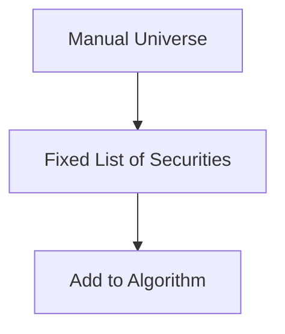
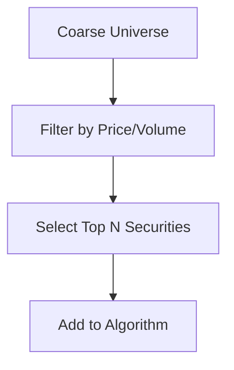
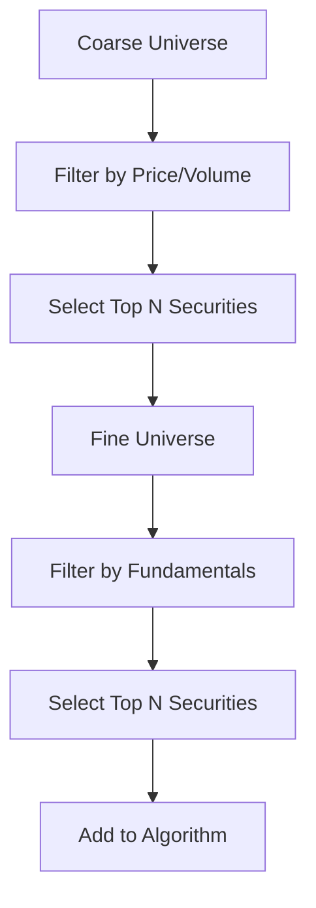
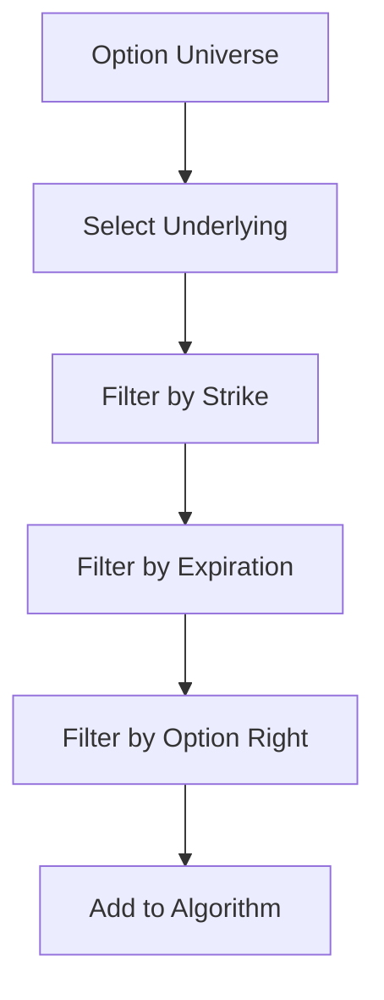
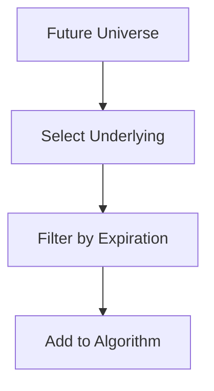

# Universe Selection

## Overview

Universe Selection is a critical component of the Algorithm Framework in QuantConnect Lean. It is responsible for selecting the securities that the algorithm will trade. This document details the universe selection process, the available models, and how to create custom universe selection models.

## What is Universe Selection?

Universe Selection is the process of choosing which securities to include in your trading algorithm. It defines the investment universe - the set of assets that your algorithm can potentially trade. The universe can be static (fixed set of securities) or dynamic (changing over time based on certain criteria).

## Universe Selection Interface

All Universe Selection Models implement the `IUniverseSelectionModel` interface:

```csharp
public interface IUniverseSelectionModel
{
    IEnumerable<Universe> CreateUniverses(QCAlgorithm algorithm);
}
```

### Key Methods

- `CreateUniverses`: Creates the universes for the algorithm based on the selection criteria.

## Universe Types

Lean supports several types of universes:

### 1. Manual Universe

The Manual Universe is the simplest form of universe selection. It allows you to manually specify the securities you want to include in your algorithm.



#### Example

```csharp
public class ManualUniverseAlgorithm : QCAlgorithm
{
    public override void Initialize()
    {
        SetStartDate(2018, 1, 1);
        SetEndDate(2018, 12, 31);
        SetCash(100000);
        
        // Manually add securities to the universe
        AddEquity("AAPL");
        AddEquity("MSFT");
        AddEquity("GOOG");
    }
}
```

### 2. Coarse Universe

The Coarse Universe allows you to select securities based on basic market data such as price and volume. It's useful for filtering out illiquid or low-priced securities.



#### Example

```csharp
public class CoarseUniverseAlgorithm : QCAlgorithm
{
    public override void Initialize()
    {
        SetStartDate(2018, 1, 1);
        SetEndDate(2018, 12, 31);
        SetCash(100000);
        
        // Add a coarse universe
        AddUniverse(CoarseSelectionFunction);
    }
    
    public IEnumerable<Symbol> CoarseSelectionFunction(IEnumerable<CoarseFundamental> coarse)
    {
        return coarse
            .Where(x => x.Price > 10 && x.DollarVolume > 10000000)
            .OrderByDescending(x => x.DollarVolume)
            .Take(10)
            .Select(x => x.Symbol);
    }
}
```

### 3. Fine Universe

The Fine Universe allows you to select securities based on detailed fundamental data such as financial statements, ratios, and company information. It's useful for implementing fundamental analysis strategies.



#### Example

```csharp
public class FineUniverseAlgorithm : QCAlgorithm
{
    public override void Initialize()
    {
        SetStartDate(2018, 1, 1);
        SetEndDate(2018, 12, 31);
        SetCash(100000);
        
        // Add a fine universe
        AddUniverse(CoarseSelectionFunction, FineSelectionFunction);
    }
    
    public IEnumerable<Symbol> CoarseSelectionFunction(IEnumerable<CoarseFundamental> coarse)
    {
        return coarse
            .Where(x => x.Price > 10 && x.DollarVolume > 10000000)
            .OrderByDescending(x => x.DollarVolume)
            .Take(100)
            .Select(x => x.Symbol);
    }
    
    public IEnumerable<Symbol> FineSelectionFunction(IEnumerable<FineFundamental> fine)
    {
        return fine
            .Where(x => x.ValuationRatios.PERatio > 0 && x.ValuationRatios.PERatio < 20)
            .OrderBy(x => x.ValuationRatios.PERatio)
            .Take(10)
            .Select(x => x.Symbol);
    }
}
```

### 4. Option Universe

The Option Universe allows you to select option contracts based on various criteria such as strike price, expiration date, and option right (call/put).



#### Example

```csharp
public class OptionUniverseAlgorithm : QCAlgorithm
{
    public override void Initialize()
    {
        SetStartDate(2018, 1, 1);
        SetEndDate(2018, 12, 31);
        SetCash(100000);
        
        // Add an option universe
        var option = AddOption("SPY");
        option.SetFilter(universe => universe
            .Strikes(-10, +10)
            .Expiration(0, 30)
            .IncludeWeeklys());
    }
    
    public override void OnData(Slice slice)
    {
        if (!Portfolio.Invested)
        {
            foreach (var chain in slice.OptionChains)
            {
                var atmStrike = chain.Value
                    .OrderBy(x => Math.Abs(chain.Value.Underlying.Price - x.Strike))
                    .First()
                    .Strike;
                
                var call = chain.Value
                    .Where(x => x.Strike == atmStrike && x.Right == OptionRight.Call)
                    .OrderBy(x => x.Expiry)
                    .First();
                
                Buy(call.Symbol, 1);
            }
        }
    }
}
```

### 5. Future Universe

The Future Universe allows you to select future contracts based on various criteria such as expiration date.



#### Example

```csharp
public class FutureUniverseAlgorithm : QCAlgorithm
{
    public override void Initialize()
    {
        SetStartDate(2018, 1, 1);
        SetEndDate(2018, 12, 31);
        SetCash(100000);
        
        // Add a future universe
        var future = AddFuture("ES");
        future.SetFilter(universe => universe
            .Expiration(0, 180));
    }
    
    public override void OnData(Slice slice)
    {
        if (!Portfolio.Invested)
        {
            foreach (var chain in slice.FutureChains)
            {
                var contract = chain.Value
                    .OrderBy(x => x.Expiry)
                    .First();
                
                Buy(contract.Symbol, 1);
            }
        }
    }
}
```

## Built-in Universe Selection Models

Lean provides several built-in universe selection models that can be used out of the box:

### 1. ManualUniverseSelectionModel

The ManualUniverseSelectionModel allows you to manually specify the securities to include in your algorithm.

#### Parameters

- `symbols`: The symbols to include in the universe

#### Example

```csharp
// Create a Manual Universe Selection Model with specific symbols
var manual = new ManualUniverseSelectionModel(
    new[] { "AAPL", "MSFT", "GOOG" }.Select(x => QuantConnect.Symbol.Create(x, SecurityType.Equity, Market.USA))
);
```

### 2. FundamentalUniverseSelectionModel

The FundamentalUniverseSelectionModel allows you to select securities based on fundamental data.

#### Parameters

- `coarseSelector`: A function that selects symbols based on coarse fundamental data
- `fineSelector`: A function that selects symbols based on fine fundamental data

#### Example

```csharp
// Create a Fundamental Universe Selection Model
var fundamental = new FundamentalUniverseSelectionModel(
    coarseSelector: coarse => coarse
        .Where(x => x.Price > 10 && x.DollarVolume > 10000000)
        .OrderByDescending(x => x.DollarVolume)
        .Take(100)
        .Select(x => x.Symbol),
    fineSelector: fine => fine
        .Where(x => x.ValuationRatios.PERatio > 0 && x.ValuationRatios.PERatio < 20)
        .OrderBy(x => x.ValuationRatios.PERatio)
        .Take(10)
        .Select(x => x.Symbol)
);
```

### 3. ETFConstituentsUniverseSelectionModel

The ETFConstituentsUniverseSelectionModel allows you to select securities based on the constituents of an ETF.

#### Parameters

- `etfSymbol`: The symbol of the ETF
- `universeFilterFunc`: A function that filters the ETF constituents

#### Example

```csharp
// Create an ETF Constituents Universe Selection Model
var etfConstituents = new ETFConstituentsUniverseSelectionModel(
    etfSymbol: "SPY",
    universeFilterFunc: constituents => constituents
        .OrderByDescending(x => x.Weight)
        .Take(10)
        .Select(x => x.Symbol)
);
```

### 4. OptionUniverseSelectionModel

The OptionUniverseSelectionModel allows you to select option contracts based on various criteria.

#### Parameters

- `underlying`: The underlying symbol
- `universeFilterFunc`: A function that filters the option contracts

#### Example

```csharp
// Create an Option Universe Selection Model
var optionUniverse = new OptionUniverseSelectionModel(
    underlying: "SPY",
    universeFilterFunc: universe => universe
        .Strikes(-10, +10)
        .Expiration(0, 30)
        .IncludeWeeklys()
);
```

### 5. FutureUniverseSelectionModel

The FutureUniverseSelectionModel allows you to select future contracts based on various criteria.

#### Parameters

- `underlying`: The underlying symbol
- `universeFilterFunc`: A function that filters the future contracts

#### Example

```csharp
// Create a Future Universe Selection Model
var futureUniverse = new FutureUniverseSelectionModel(
    underlying: "ES",
    universeFilterFunc: universe => universe
        .Expiration(0, 180)
);
```

## Creating Custom Universe Selection Models

You can create custom Universe Selection Models by inheriting from the `UniverseSelectionModel` base class or implementing the `IUniverseSelectionModel` interface:

```csharp
public class MyUniverseSelectionModel : UniverseSelectionModel
{
    private readonly Symbol[] _symbols;
    
    public MyUniverseSelectionModel(Symbol[] symbols)
    {
        _symbols = symbols;
    }
    
    public override IEnumerable<Universe> CreateUniverses(QCAlgorithm algorithm)
    {
        // Create a manual universe with the specified symbols
        yield return new ManualUniverse(
            algorithm.Time,
            _symbols
        );
    }
}
```

## Universe Selection in the Algorithm Framework

To use a Universe Selection Model in the Algorithm Framework, you need to set it up in your algorithm's `Initialize` method:

```csharp
public class MyAlgorithm : QCAlgorithm
{
    public override void Initialize()
    {
        SetStartDate(2018, 1, 1);
        SetEndDate(2018, 12, 31);
        SetCash(100000);
        
        // Set up the universe selection model
        SetUniverseSelection(new MyUniverseSelectionModel(
            new[] { "AAPL", "MSFT", "GOOG" }.Select(x => QuantConnect.Symbol.Create(x, SecurityType.Equity, Market.USA)).ToArray()
        ));
        
        // Set up the rest of the framework
        SetAlpha(new EmaCrossAlphaModel());
        SetPortfolioConstruction(new EqualWeightingPortfolioConstructionModel());
        SetExecution(new ImmediateExecutionModel());
        SetRiskManagement(new NullRiskManagementModel());
    }
}
```

## Universe Selection Events

When the universe changes, the algorithm and other framework components are notified through the `OnSecuritiesChanged` event. This allows them to initialize or clean up resources for securities.

```csharp
public class MyAlphaModel : AlphaModel
{
    private readonly Dictionary<Symbol, SymbolData> _symbolData;
    
    public MyAlphaModel()
    {
        _symbolData = new Dictionary<Symbol, SymbolData>();
    }
    
    public override IEnumerable<Insight> Update(QCAlgorithm algorithm, Slice data)
    {
        // Generate insights based on the current universe
        var insights = new List<Insight>();
        foreach (var kvp in _symbolData)
        {
            // Generate insights for each security in the universe
        }
        return insights;
    }
    
    public override void OnSecuritiesChanged(QCAlgorithm algorithm, SecurityChanges changes)
    {
        // Initialize resources for added securities
        foreach (var security in changes.AddedSecurities)
        {
            _symbolData[security.Symbol] = new SymbolData(security.Symbol);
        }
        
        // Clean up resources for removed securities
        foreach (var security in changes.RemovedSecurities)
        {
            _symbolData.Remove(security.Symbol);
        }
    }
    
    private class SymbolData
    {
        public Symbol Symbol { get; }
        
        public SymbolData(Symbol symbol)
        {
            Symbol = symbol;
        }
    }
}
```

## Best Practices

### 1. Filter Effectively

When selecting securities, filter effectively to reduce the universe size. This improves performance and reduces resource usage.

### 2. Consider Liquidity

Include liquidity filters (e.g., dollar volume) to ensure you're trading securities with sufficient liquidity.

### 3. Avoid Look-Ahead Bias

Be careful not to use future information in your universe selection. For example, don't use today's price to select securities for today's trading.

### 4. Handle Universe Changes

Properly handle universe changes in your algorithm and framework components. Initialize resources for added securities and clean up resources for removed securities.

### 5. Test with Different Universe Sizes

Test your algorithm with different universe sizes to ensure it scales well. A strategy that works with 10 securities might not work with 100 securities.

## Conclusion

Universe Selection is a critical component of the Algorithm Framework in QuantConnect Lean. It defines the investment universe for your algorithm and can significantly impact performance. By understanding and effectively using Universe Selection, you can create more robust and efficient trading strategies.